# 대진대 시간표 — Release Notes v2.0

> 이 문서는 2026년 6월 업데이트 기준으로 추가·변경된 모든 기능과 작동 원리를 정리한 릴리즈 노트입니다.

---

## 목차

1. [보안 개선](#1-보안-개선)
2. [성능 개선](#2-성능-개선)
3. [코드 리팩토링](#3-코드-리팩토링)
4. [시간표 색상 테마](#4-시간표-색상-테마)
5. [AI 관찰성 시스템](#5-ai-관찰성-시스템)
6. [통합 관리자 페이지](#6-통합-관리자-페이지)
7. [백엔드 신규 엔드포인트](#7-백엔드-신규-엔드포인트)

---

## 1. 보안 개선

### 관리자 비밀번호 서버 이전

**Before**
- `VITE_ADMIN_PASSWORD` 환경변수를 프론트엔드 번들에 포함시켜 클라이언트 비교
- 브라우저 개발자 도구 → JS 소스에서 누구나 비밀번호 확인 가능

**After**
- `ADMIN_PASSWORD`는 백엔드 `.env`에만 존재
- 프론트엔드는 `/api/admin/verify`로 POST 요청 → 서버가 비교 후 성공/실패 반환

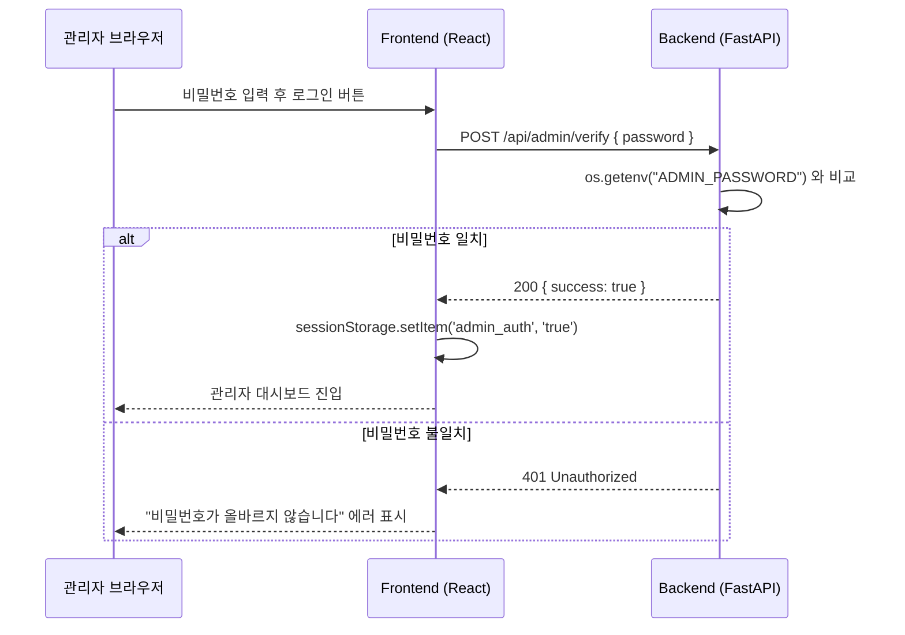

### Firestore O(n) 스캔 → O(1) 직접 조회 수정

피드백 관리 기능에서 댓글 추가/수정/삭제 시 전체 피드백을 다운로드한 뒤 ID로 찾는 방식을 직접 문서 참조로 수정했습니다.

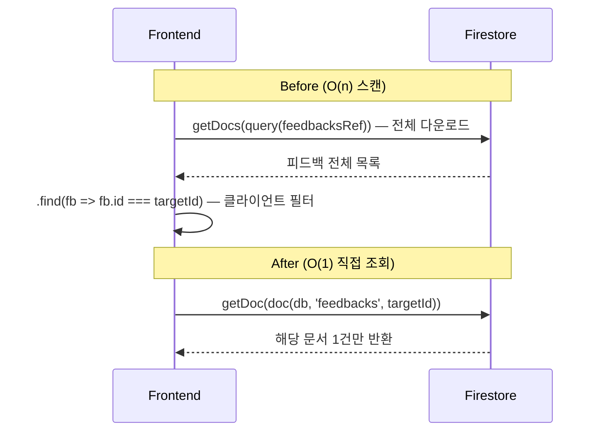

---

## 2. 성능 개선

### filterAvailableCourses 병렬 처리

추천 페이지에서 수강 가능한 과목을 필터링할 때 Firestore 쿼리가 최대 7개 순차 실행되던 문제를 `Promise.all`로 병렬화했습니다.

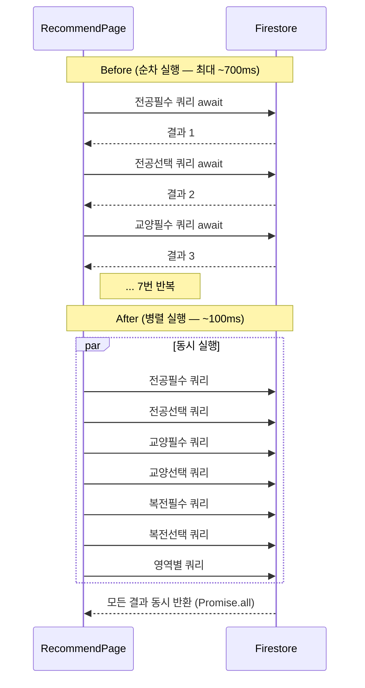

---

## 3. 코드 리팩토링

### parseScheduleToTimes 중복 제거

`"화10:00-11:30, 목10:00-11:30"` 형식의 시간표 문자열을 파싱하는 함수가 7곳에 복사되어 있던 것을 `src/utils/timeUtils.js` 단일 파일로 통합했습니다.

| 파일 | Before | After |
|---|---|---|
| `RecommendPage.jsx` | 47줄 로컬 함수 | import |
| `useSchedule.js` | 40줄 로컬 함수 | import |
| `CourseBlock.jsx` | `timeToMinutes` 로컬 함수 | import |
| 그 외 4곳 | 각자 구현 | import |

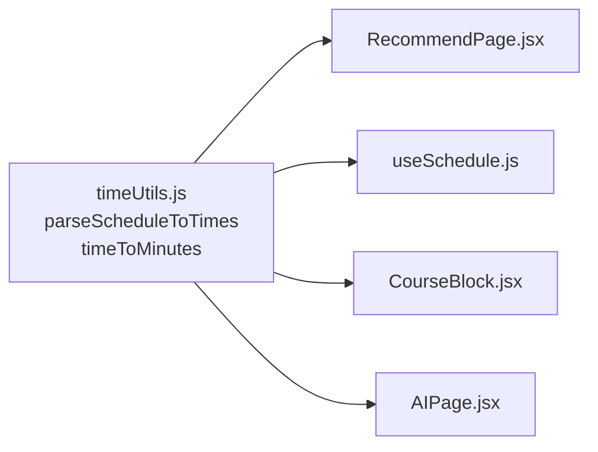

---

## 4. 시간표 색상 테마

사용자가 시간표 블록의 색상 테마를 선택할 수 있는 기능을 추가했습니다.

### 제공 테마 (5종)

| 테마명 | 특징 |
|---|---|
| 파스텔 (기본) | 연하고 부드러운 색상 |
| 비비드 | 선명하고 강렬한 색상 |
| 쿨톤 | 파랑·보라 계열 |
| 웜톤 | 주황·노랑 계열 |
| 모노톤 | 흑백 그레이 계열 |

### 동작 흐름

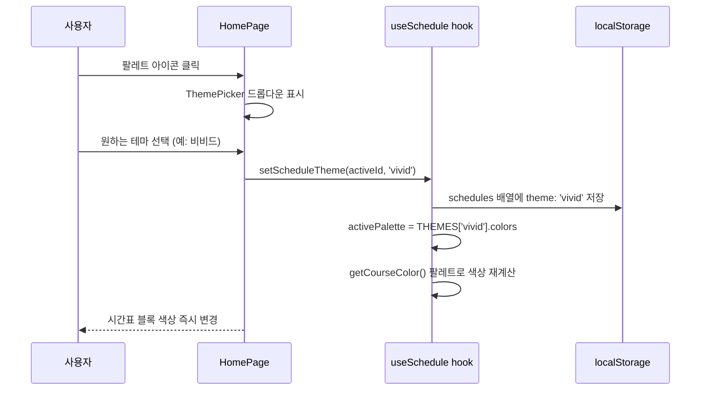

### 구현 방식 — Tailwind 정적 클래스

Tailwind CSS는 빌드 시점에 사용되는 클래스만 번들에 포함합니다. 동적 문자열 조합(`bg-${color}-500`)은 번들에서 제외됩니다. 따라서 `constants.js`에 모든 클래스를 **리터럴 문자열**로 명시했습니다.

```js
// constants.js — 클래스를 리터럴로 명시 (동적 조합 불가)
pastel: {
  colors: [
    { bg: 'bg-pink-100', border: 'border-pink-300', text: 'text-pink-800' },
    { bg: 'bg-blue-100', border: 'border-blue-300', text: 'text-blue-800' },
    // ...
  ]
}
```

---

## 5. AI 관찰성 시스템

AI 호출 결과를 추적하고 사용자 피드백을 수집하는 관찰성(Observability) 시스템을 추가했습니다.

### 전체 아키텍처

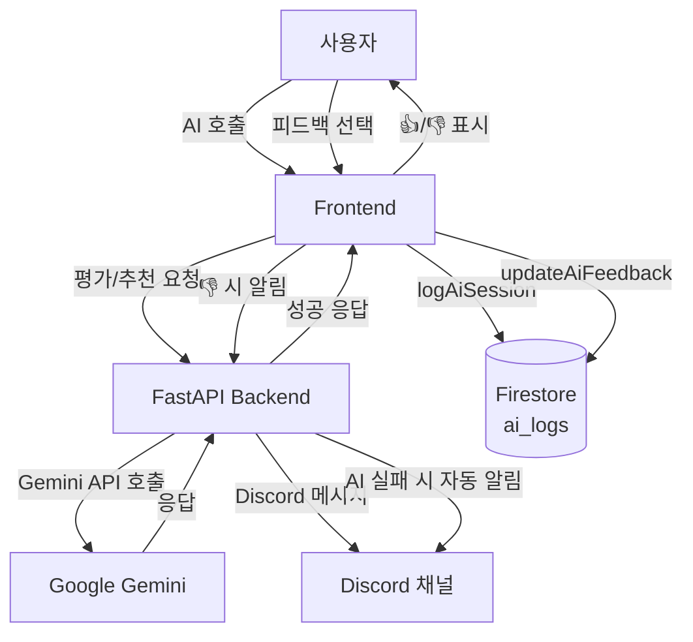

### AI 세션 로깅 흐름

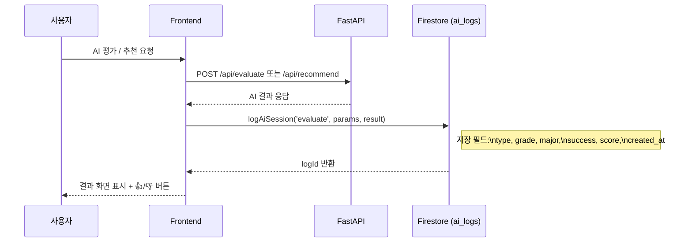

### 사용자 피드백 (👍/👎) 흐름

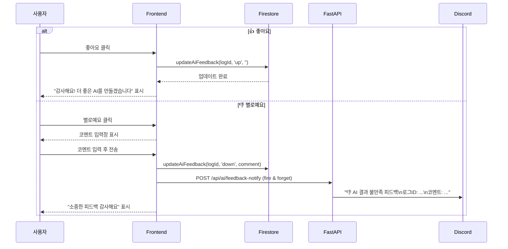

### AI 실패 자동 알림 흐름

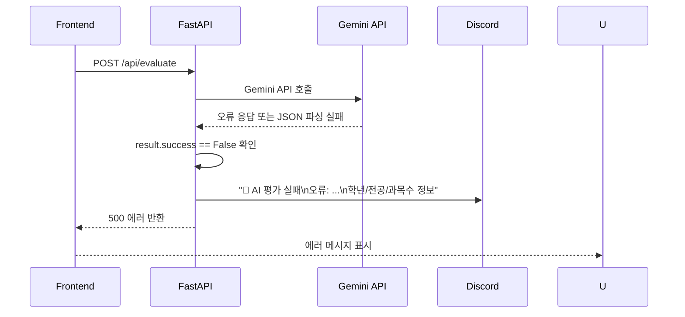

### Gemini JSON 파싱 재시도 로직 (recommend_service)

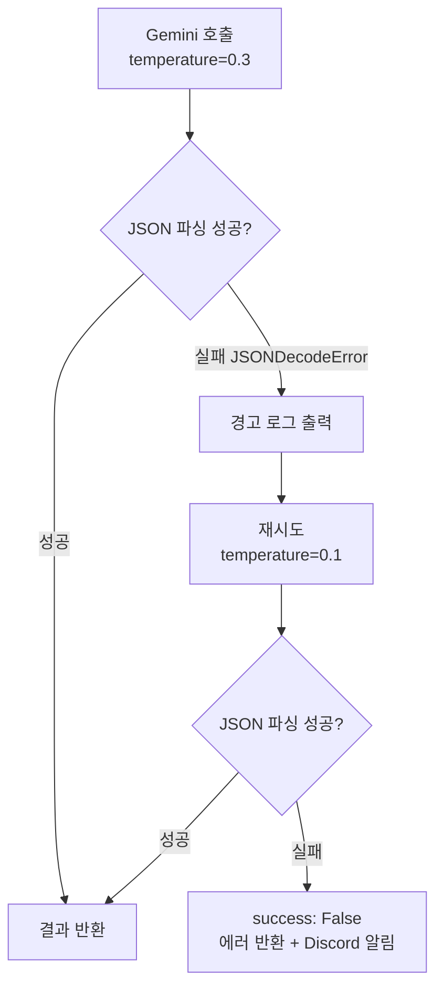

---

## 6. 통합 관리자 페이지

기존에 `/feedback/admin`, `/updates/admin` 두 곳으로 분산되어 있던 관리자 기능을 `/admin` 단일 페이지로 통합했습니다.

### 탭 구성

| 탭 | 내용 |
|---|---|
| 서버 상태 | FastAPI 헬스체크, 응답시간, AI 실제 동작 테스트, 최근 실패 목록 |
| AI 로그 | 세션 통계, 성공률, 👍/👎 집계, 학과·학년별 사용 패턴 |
| 과목 데이터 | Firestore courses 컬렉션 카테고리별 문서 수 |
| 피드백 | 기존 피드백 관리 (상태변경·댓글·삭제) |
| 업데이트 | 기존 업데이트 공지 관리 |

### 서버 상태 탭 — 헬스체크 흐름

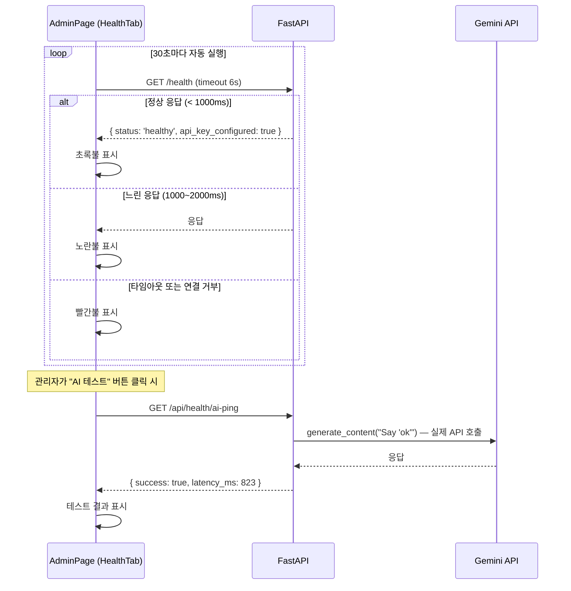

### AI 로그 탭 — 사용 패턴 집계

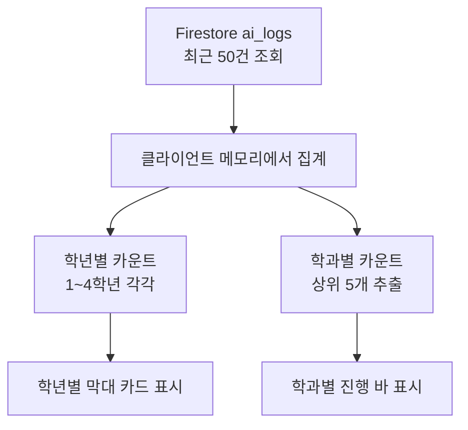

### 과목 데이터 탭 — getCountFromServer

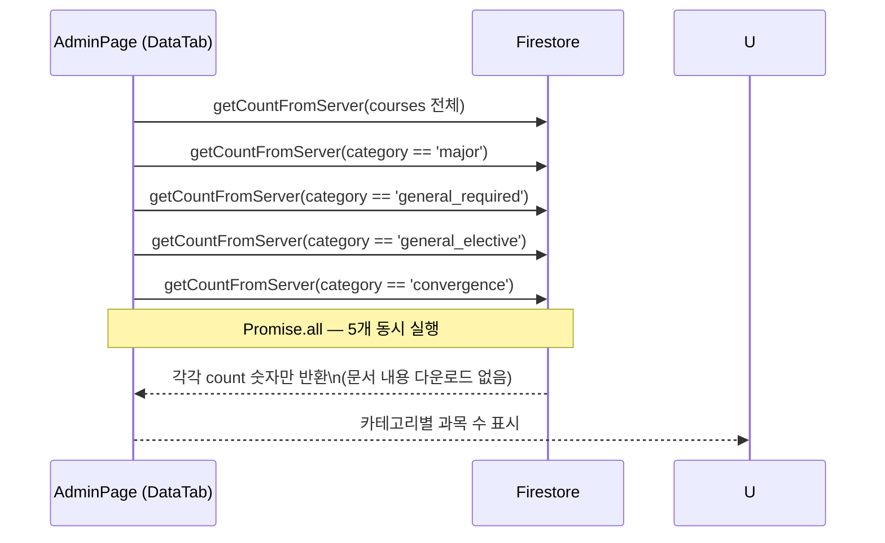

### 인증 방식 변경

```mermaid
flowchart LR
    subgraph Before
        direction TB
        P1[/feedback/admin\nlocalStorage: feedback_admin_auth]
        P2[/updates/admin\nlocalStorage: update_admin_auth]
    end

    subgraph After
        direction TB
        P3[/admin\nsessionStorage: admin_auth\n탭 닫으면 자동 로그아웃]
    end
```

---

## 7. 백엔드 신규 엔드포인트

| 엔드포인트 | 메서드 | 설명 |
|---|---|---|
| `/api/admin/verify` | POST | 관리자 비밀번호 서버 검증 |
| `/api/ai/feedback-notify` | POST | 👎 피드백 Discord 알림 |
| `/api/health/ai-ping` | GET | Gemini 실제 응답 테스트 |

### /api/health/ai-ping 흐름

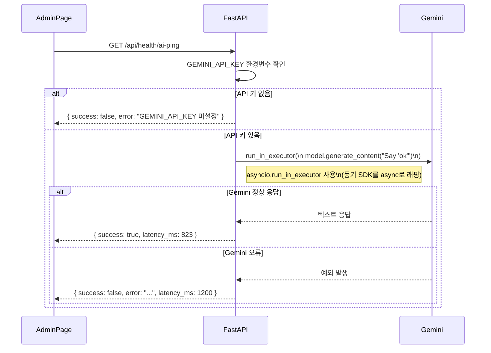

---

## 변경 파일 목록

### 신규 생성
- `src/pages/AdminPage.jsx` — 통합 관리자 페이지
- `src/components/AiFeedback.jsx` — 👍/👎 피드백 컴포넌트
- `src/services/aiLogService.js` — AI 세션 로깅 서비스
- `src/utils/timeUtils.js` — 시간표 파싱 유틸 (parseScheduleToTimes, timeToMinutes)

### 수정
- `dju-timetable-api/main.py` — 신규 엔드포인트 3개, Discord 헬퍼
- `dju-timetable-api/services/recommend_service.py` — JSON 파싱 재시도 로직
- `src/App.jsx` — `/admin` 라우트 추가, React Router v7 플래그
- `src/pages/AIPage.jsx` — AI 로깅 + AiFeedback 연동
- `src/pages/RecommendPage.jsx` — AI 로깅 + AiFeedback 연동, filterAvailableCourses 병렬화, 훅 기반 저장
- `src/pages/FeedbackAdminPage.jsx` — 서버 인증으로 전환
- `src/pages/UpdateAdminPage.jsx` — 서버 인증으로 전환
- `src/services/feedbackService.js` — verifyAdminPassword API 방식, getDoc 직접 조회
- `src/hooks/useSchedule.js` — 테마 시스템, parseScheduleToTimes import
- `src/data/constants.js` — THEMES 5종 추가

---

*Generated: 2026-06-28*
