# 대진대 시간표 — Release Notes v3.0 (AI 성능·안정성 개선)

> 2026년 7월 28일 작업 기준. AI 추천 기능의 **응답 시간, 실패율, 비용, 관찰성**을 개선한 내역과
> 그 과정에서 세운 가설·실험·측정 결과를 함께 정리한 문서입니다.
>
> 모든 수치는 실제 2026-2학기 강의 데이터와 Gemini API 실호출로 측정했습니다.

---

## 목차

1. [한눈에 보기](#1-한눈에-보기)
2. [응답 시간 — 후보 생성 병렬화](#2-응답-시간--후보-생성-병렬화)
3. [생성 실패 — thinking 토큰이 예산을 잠식하던 문제](#3-생성-실패--thinking-토큰이-예산을-잠식하던-문제)
4. [후보 다양성 — 공강 축 도입과 실현 가능성 계산](#4-후보-다양성--공강-축-도입과-실현-가능성-계산)
5. [관찰성 — 실패 로그가 관리자 페이지에 없던 문제](#5-관찰성--실패-로그가-관리자-페이지에-없던-문제)
6. [비용 방어 — Rate Limit과 일일 상한](#6-비용-방어--rate-limit과-일일-상한)
7. [안정성 — 타임아웃과 지수 백오프 재시도](#7-안정성--타임아웃과-지수-백오프-재시도)
8. [토큰 절감 — 응답 형식 축소](#8-토큰-절감--응답-형식-축소)
9. [이탈-재시도 낭비 — 결과 캐시와 요청 합치기](#9-이탈-재시도-낭비--결과-캐시와-요청-합치기)
10. [UI/UX — 기다릴 수 있게 만들기](#10-uiux--기다릴-수-있게-만들기)
11. [프론트엔드 — Firestore 중복 조회 제거](#11-프론트엔드--firestore-중복-조회-제거)
12. [실험 기록 — 모델 교체 검토](#12-실험-기록--모델-교체-검토)
13. [SDK 이전 — google-genai](#13-sdk-이전--google-genai)
14. [테스트로 잡은 버그](#14-테스트로-잡은-버그)
15. [환경변수](#15-환경변수)
16. [배포 체크리스트](#16-배포-체크리스트)
17. [남은 과제](#17-남은-과제)

---

## 1. 한눈에 보기

### 개선 요약

| 항목 | Before | After | 개선 |
|---|---|---|---|
| 추천 응답 시간 (중앙값) | 60.9초 | 19.6초 | **-68%** |
| 생성 실패 | 간헐적 (재현 시 3/3 실패) | 4/4 성공 | 해결 |
| 후보 개수 | 3개 (품질 모호) | 2개 (축이 명확) | — |
| 동시 사용자 처리 | 평가/수정 시 **전체 대기** | 병렬 처리 | 해결 |
| 이탈 후 재시도 | 매번 새로 생성 | 캐시 재사용 | AI 호출 **1/3** |
| Rate Limit | 없음 | IP별 + 일일 상한 | 신규 |
| 실패 로그 | Discord만 | Discord + 관리자 페이지 | 신규 |
| SDK | `google-generativeai` (지원 종료) | `google-genai` | 이전 |

### 전체 흐름 비교

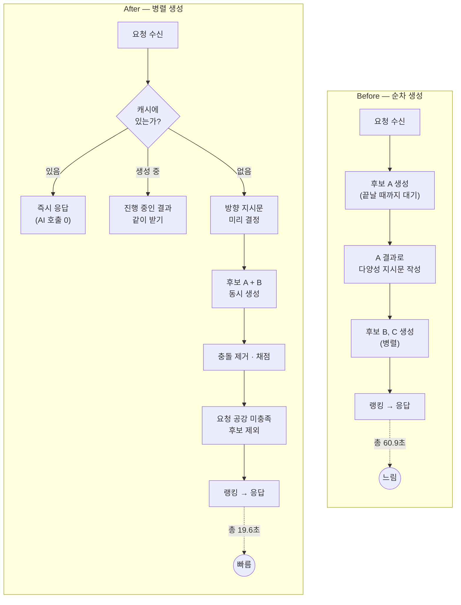

---

## 2. 응답 시간 — 후보 생성 병렬화

### 문제

사용자가 "다른 서비스보다 시간표 나오는 게 느리다"고 이탈하는 문제가 있었습니다.

코드를 열어보니 후보 3개를 만드는데, **A를 끝까지 기다린 뒤에야 B·C를 시작**하고 있었습니다.

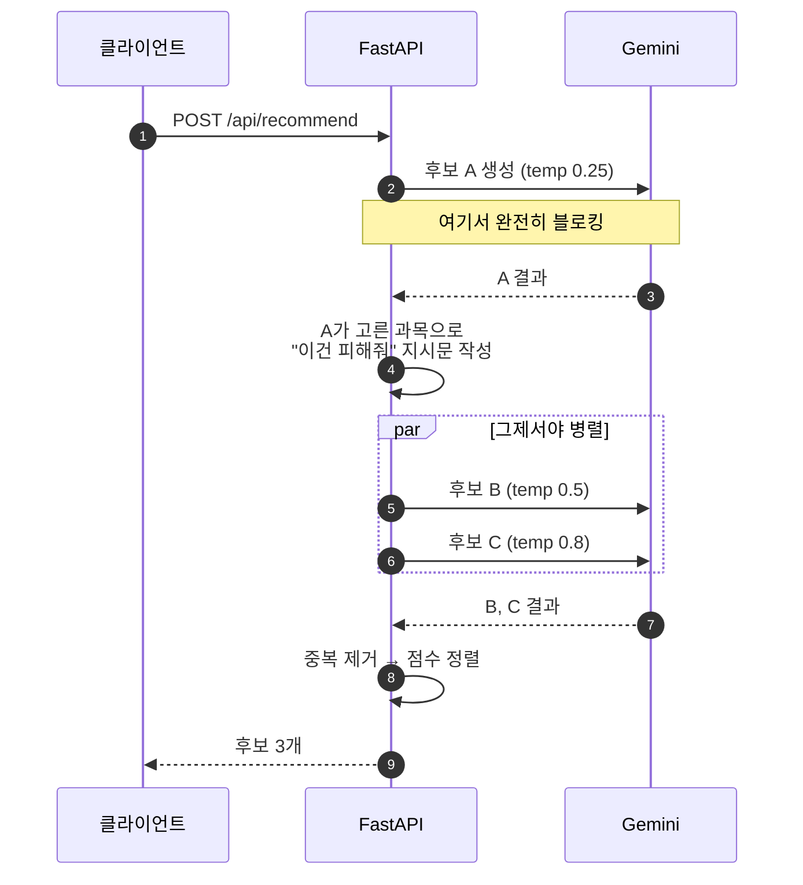

걸리는 시간 = `T_A + max(T_B, T_C)` ≈ **LLM 호출 2회분**

### 가설

> B·C가 A를 기다리는 이유는 `_diversity_note(_elective_names(cand_a))` 하나뿐이다.
> 이건 "A가 고른 선택과목은 피해줘"라는 **소프트 힌트**이고,
> 실제 중복 제거는 뒤에서 Jaccard 유사도 0.85 필터가 따로 한다.
> 따라서 **없어도 되는 의존성**이며, 제거하면 전부 병렬로 돌릴 수 있다.

### 실험

세 가지 설정을 번갈아 돌려 네트워크 변동 영향을 줄였습니다.
(간호학과 2학년 / 18학점 / 금요일 공강 요청, 각 2회)

| 설정 | 중앙값 | 개별 측정 |
|---|---|---|
| OLD n=3 (변경 전) | 60.9초 | 57.3, 64.5 |
| OLD n=2 (순차 + 후보 축소) | 52.8초 | 56.5, 49.0 |
| **NEW n=2 (병렬 + 후보 축소)** | **25.9초** | 28.4, 23.4 |

**핵심 발견:** 후보를 3→2개로 줄이는 것만으로는 **-13%**에 그쳤지만,
병렬화는 후보 개수를 유지한 채로도 **-51%**였습니다.
병렬 실행에서 걸리는 시간은 `max(T_A, T_B)`이므로, 후보를 줄여도
"가장 느린 하나"가 바뀔 뿐이라 효과가 작습니다.

### 해결

A의 결과를 기다리는 대신, 후보마다 **미리 정해둔 방향**을 부여합니다.

```python
variants = _build_variants(user_info, available_courses, num_candidates)

results = await asyncio.gather(*[
    _generate_candidate(base_prompt + locked_note + note, ...,
                        temperature=temp, errors=errors)
    for temp, note in variants
], return_exceptions=True)
```

| 후보 | temperature | 방향 |
|---|---|---|
| A | 0.25 | 지시문 없음 — 순수 최적 |
| B | 0.55 | 요청한 공강 유지 + **하루 더 비우기** |
| C (선택) | 0.85 | 과목 구성 축 (`num_candidates=3`일 때만) |

`asyncio.gather`는 순서를 보존하므로 A가 항상 배열 맨 앞에 오고,
중복 제거 시 A가 우선 살아남습니다.

**후보 기본 개수는 3 → 2로 축소**했습니다. 속도 때문이 아니라
세 번째 후보의 라벨이 `"OO 등 과목 구성 다름"`으로 **선택 근거가 되지 못했기** 때문입니다.
`num_candidates` 파라미터는 남아 있어 나중에 "다른 대안 더 보기"를 붙일 수 있습니다.

---

## 3. 생성 실패 — thinking 토큰이 예산을 잠식하던 문제

### 문제

배포 후 사용자 실패 로그가 Discord로 도착했습니다.

```
오류: 시간표 생성에 실패했습니다.
  (생성 실패 (temp=0.25): JSONDecodeError: Expecting value: line 1 column 1 (char 0)
 | 생성 실패 (temp=0.55): JSONDecodeError: Expecting ',' delimiter: line 1 column 8 (char 7))
학년: 3학년  전공: 의생명과학과  목표학점: 18  공강요일: ['금']
```

두 후보가 **다른 방식으로** 깨졌습니다.

- `char 0` → 응답이 **비어 있음** (잘린 게 아니라 아무것도 없음)
- `column 8` → 7글자째에서 깨짐

### 진단

원본 응답을 그대로 받아 `finish_reason`과 토큰 사용량을 확인했습니다.

```
후보 A: finish_reason=2 (MAX_TOKENS)
        prompt 5,086 + 출력 630 = 5,716   그런데 total 13,274 → 차이 7,558
후보 B: finish_reason=1 (STOP)
        prompt 5,249 + 출력 903 = 6,152   그런데 total 11,149 → 차이 4,997
```

**원인:** `gemini-flash-latest`는 thinking 모델이라 내부 추론 토큰이
`max_output_tokens` 예산을 답변과 **나눠 씁니다.**

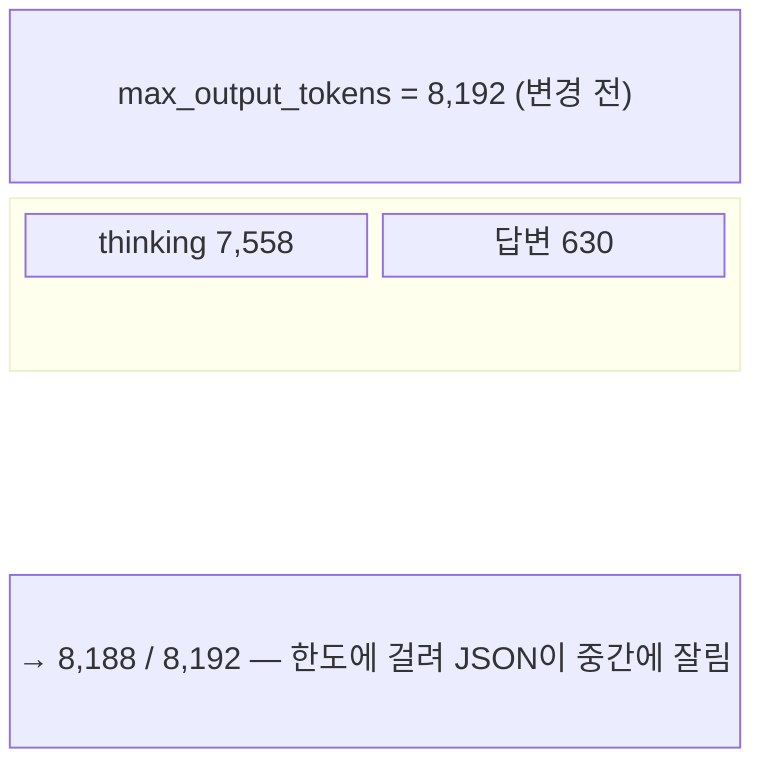

thinking 사용량이 **3,800~7,600 사이에서 널뛰는데** 예산이 8,192뿐이라,
추론이 길어진 요청만 실패하는 구조였습니다. 사용자 입장에서는
"어떤 날은 되고 어떤 날은 안 되는" 것으로 보였습니다.

### 실험

```
설정                     시간     finish_reason   thinking   출력   파싱
현재(8192, 일반)        29.1s    STOP             5,916      937   OK
32768, 일반             21.7s    STOP             4,184      920   OK
32768, JSON 모드        21.1s    STOP             3,870      907   OK
```

### 해결

**1) 토큰 예산 상향** — 8,192 → 32,768. 5개 호출 지점 전부.
같은 폭탄이 평가·수정 기능에도 있었습니다.

**2) JSON 모드** — `response_mime_type="application/json"`.
마크다운 코드블록·잡문 없이 순수 JSON만 받습니다.

**3) 원인이 보이는 에러** — `finish_reason`을 확인해 변환합니다.

```python
if reason == types.FinishReason.MAX_TOKENS:
    raise RuntimeError(f"응답이 토큰 한도에서 잘림 (MAX_TOKENS, {len(text)}자 수신)")
if not text.strip():
    raise RuntimeError(f"빈 응답 ({label})")
```

이전에는 `JSONDecodeError`만 보여 원인을 알 수 없었습니다.

### 검증

같은 조건(3학년 의생명과학과 / 18학점 / 금 공강)으로 4회 재현:

```
round 1~4: 전부 ✅ | A:공강['금'] | B:공강['월','금'] 100점 | 중앙값 20.4s
성공 4/4, 후보 2개 유지
```

---

## 4. 후보 다양성 — 공강 축 도입과 실현 가능성 계산

### 가설과 첫 실패

후보 B에 "요청한 공강은 유지하고 하루 더 비워달라"는 방향을 줬는데,
간호학과 케이스에서 **두 번 다 실패**했습니다. B의 공강이 A와 동일하게 나왔습니다.

지시문을 세 가지 강도로 바꿔 재실험했지만 결과가 같았습니다.

```
v1 현재문구            26s | 공강 ['금'] | 월요일 수업 2개
v2 강한지시            22s | 공강 ['금'] | 월요일 수업 2개
v3 강한지시+학점양보   21s | 공강 ['금'] | 월요일 수업 2개
```

### 진단 — 프롬프트가 아니라 데이터 문제였다

강의 데이터를 직접 분석했습니다.

```
필수과목이 걸린 요일 (모든 분반 기준)
  월: 막힘 — 성인간호학1, 기본간호학Ⅱ
  화: 막힘 — 아동간호학1
  수: 가능
  목: 막힘 — 간호용어
  금: 가능 (사용자가 이미 요청)
```

**월요일 공강은 애초에 불가능한 요청이었습니다.**
전공필수 두 과목이 월요일 분반밖에 없어서, "필수과목 우선"이라는
하드 제약을 지키는 한 절대 비울 수 없습니다.
**모델은 옳게 행동했고, 목표 요일을 잘못 고른 쪽이 문제였습니다.**

실제로 가능한 요일(수요일)로 지정하니 성공했습니다.

```
수요일 목표: ✅ 공강 ['수','금'] | 17학점 | 100점
```

### 해결

서버가 강의 데이터로 **비울 수 없는 요일을 미리 계산**합니다. LLM 호출이 필요 없습니다.

```python
def _blocked_empty_days(available_courses: dict) -> set:
    """모든 분반이 같은 요일에만 열리는 필수과목이 있으면 그 요일은 절대 못 비운다."""
    by_course = defaultdict(set)
    for key in ('general_required', 'major_required', 'double_major_required'):
        for c in available_courses.get(key, []) or []:
            found = {d for d in ['월','화','수','목','금'] if d in c.get('schedule_raw', '')}
            if found:
                by_course[c.get('course_name', '')] |= found
    return {next(iter(ds)) for ds in by_course.values() if len(ds) == 1}
```

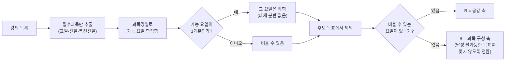

### 추가 발견 — 요청 공강을 맞바꾸는 후보

수정 후 검증에서 B가 **수요일을 비우려고 사용자가 요청한 금요일을 포기**하는 사례가 나왔습니다.

```
A: 공강['금'] 19학점 100점
B: 공강['수'] 17학점   0점   ← 요청을 무시
```

이 fixture는 설정한 선호가 "금요일 공강" 하나뿐이라 점수가 0이 됩니다.
B는 공강을 **하나 더** 얹으라는 것이지 맞바꾸라는 게 아니므로 걸러냅니다.

```python
requested_days = set(prefs.get('empty_days', []) or [])
if requested_days:
    kept = [c for c in candidates if requested_days <= set(c.get('empty_days', []) or [])]
    if kept:   # 지킨 후보가 하나도 없으면 어쩔 수 없이 그대로 둔다
        candidates = kept
```

수정 후:

```
간호학과  round1: A:공강['금'] 100점 | B:공강['금'] 100점
          round2: A:공강['금'] 100점 | B:공강['수','금'] 100점  ← 둘 다 확보
의생명    round1~4: B가 매번 공강['월','금'] 100점
```

---

## 5. 관찰성 — 실패 로그가 관리자 페이지에 없던 문제

### 문제

AI 실패 알림은 Discord로 잘 도착하는데, **관리자 페이지의 "최근 AI 실패"는 항상 비어 있었습니다.**

### 원인

로그 경로가 두 갈래로 갈라져 있었습니다.

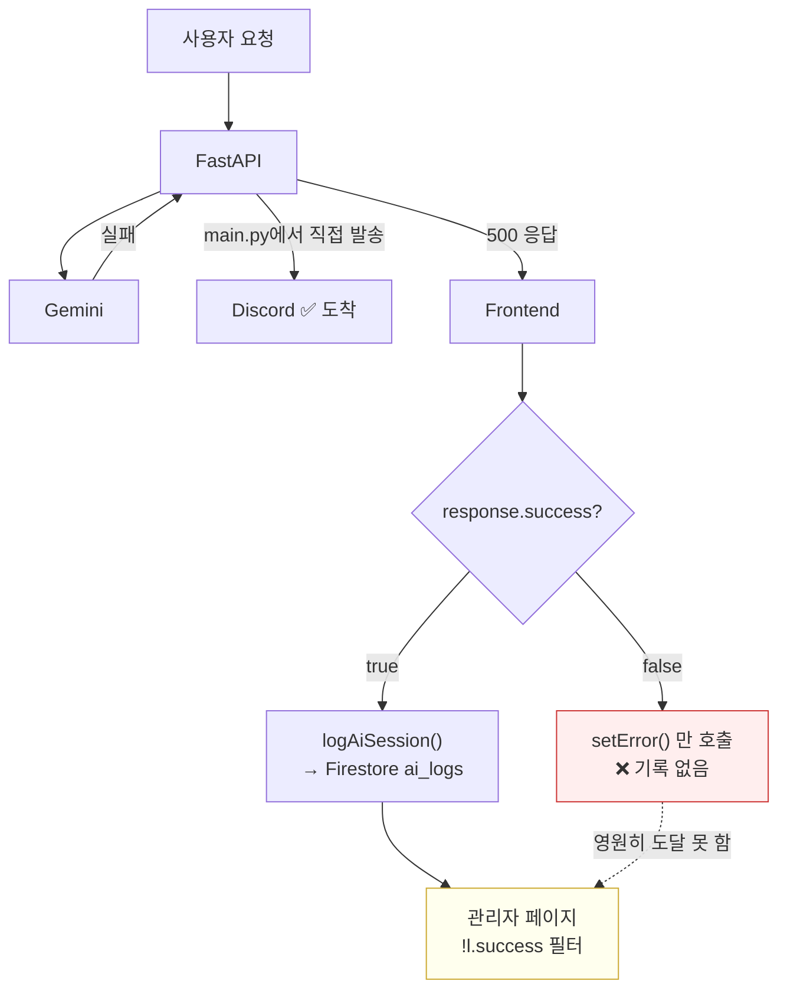

`logAiSession()`이 `if (response.success)` **블록 안에만** 있어서,
실패 문서가 `ai_logs` 컬렉션에 **하나도 만들어지지 않았습니다.**

부작용으로 **성공률 게이지가 항상 100%** 였습니다.
성공한 세션만 저장되니 `successCount / total`이 언제나 1이었습니다.

### 해결

| 변경 | 파일 |
|---|---|
| `else`·`catch` 분기에서도 `logAiSession()` 호출 | `RecommendPage.jsx`, `AIPage.jsx` |
| `error` 필드 추가 (왜 실패했는지 저장) | `aiLogService.js` |
| 실패 카드에 원인·목표학점·공강요일 표시 | `AdminPage.jsx` |
| 로그 목록의 실패 항목에도 원인 표시 | `AdminPage.jsx` |

`catch` 분기까지 넣은 이유는, **서버에 아예 연결이 안 되는 경우**를 잡기 위해서입니다.
이 경우는 백엔드가 죽어 있어 Discord 알림조차 오지 않으므로 오히려 더 중요합니다.

> **주의:** 과거 실패는 소급되지 않습니다. 기록 자체가 없었기 때문입니다.
> 또한 이제 실패가 분모·분자에 들어가므로 **성공률이 100%에서 내려갑니다.** 그게 실제 수치입니다.

---

## 6. 비용 방어 — Rate Limit과 일일 상한

### 문제

Gemini를 호출하는 엔드포인트에 **인증도 rate limit도 없었습니다.**
CORS 미들웨어는 있지만 **CORS는 브라우저만 막습니다.** `curl`이나 스크립트는 그냥 통과합니다.

| 엔드포인트 | 인증 | 1회 비용 |
|---|---|---|
| `POST /api/recommend` | 없음 | Gemini 2회 (입력 ~10k + thinking 8~12k) |
| `POST /api/evaluate` | 없음 | Gemini 1회 |
| `POST /api/recommend/modify` | 없음 | Gemini 1회 |
| `GET /api/health/ai-ping` | **없음** | Gemini 1회 — **GET이라 주소창에 붙여넣기만 해도 호출** |
| `POST /api/admin/verify` | — | 무제한 비밀번호 시도 가능 |

### 해결 — `services/rate_limit.py` (신규)

외부 의존성 없이 메모리 기반 슬라이딩 윈도우로 구현했습니다.

| 버킷 | 제한 |
|---|---|
| `recommend` | 분당 5회 · 시간당 40회 |
| `evaluate`, `modify` | 분당 10회 · 시간당 60회 |
| `ai_ping` | 분당 5회 · 시간당 20회 |
| `admin_verify` | **5분당 5회** (브루트포스 차단) |
| `notify` (Discord 웹훅) | 분당 10회 · 시간당 60회 |

**프록시 뒤 IP 처리**가 중요합니다. Render/Railway 뒤에서는
`request.client.host`가 프록시 IP라 **전체 사용자가 한 버킷을 공유**해버립니다.

```python
def client_ip(request: Request) -> str:
    xff = request.headers.get("x-forwarded-for")
    if xff:
        return xff.split(",")[0].strip()
    real = request.headers.get("x-real-ip")
    if real:
        return real.strip()
    return request.client.host if request.client else "unknown"
```

### AI 일일 상한

폭주 시 마지막 안전핀입니다.

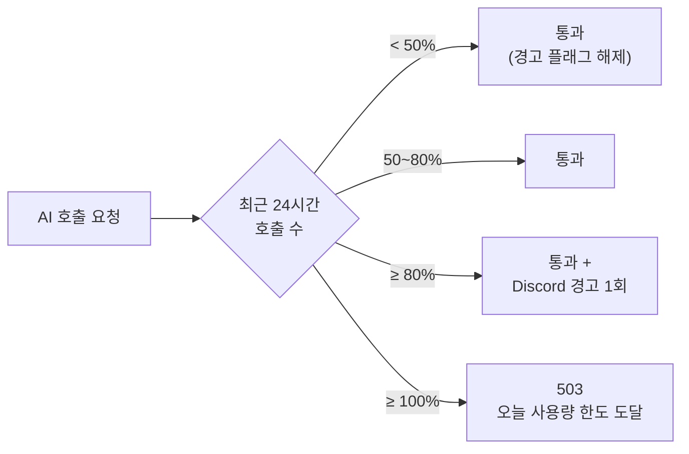

기본 500회이며 `DAILY_AI_LIMIT` 환경변수로 조정합니다.
사용량은 `/health`에서 확인할 수 있습니다.

> **ai-ping의 한계:** 관리자 페이지가 Firebase Auth를 쓰는데 백엔드에 `firebase-admin`이
> 없어 토큰 검증이 불가능합니다. 완전한 잠금이 아니라 **강한 빈도 제한 + 일일 상한 포함**으로
> 처리했습니다. 남은 리스크로 인지하고 있어야 합니다.

---

## 7. 안정성 — 타임아웃과 지수 백오프 재시도

### 조사 결과 — 폭주 위험은 없었다

"500/429에 백오프 없이 재시도하는 코드가 있으면 할당량이 순식간에 탕진된다"는
우려로 조사했으나, 실제로는 반대였습니다.

- 유일한 재시도 루프는 **호출자가 없는 죽은 코드**였습니다 (83줄 제거)
- 그마저도 `JSONDecodeError`일 때만 재시도하고 API 오류엔 즉시 반환했습니다
- 프론트엔드에 자동 재요청 로직은 **없었습니다**

문제는 정반대였습니다.

### 문제 1 — 타임아웃 부재

**Gemini 호출에 타임아웃이 없었습니다.** 응답이 오지 않으면 요청이 무한정 매달립니다.

### 문제 2 — 일시적 오류에 재시도 없음

전이적 실패(429/5xx)가 나면 그냥 실패로 끝났습니다.

### 해결

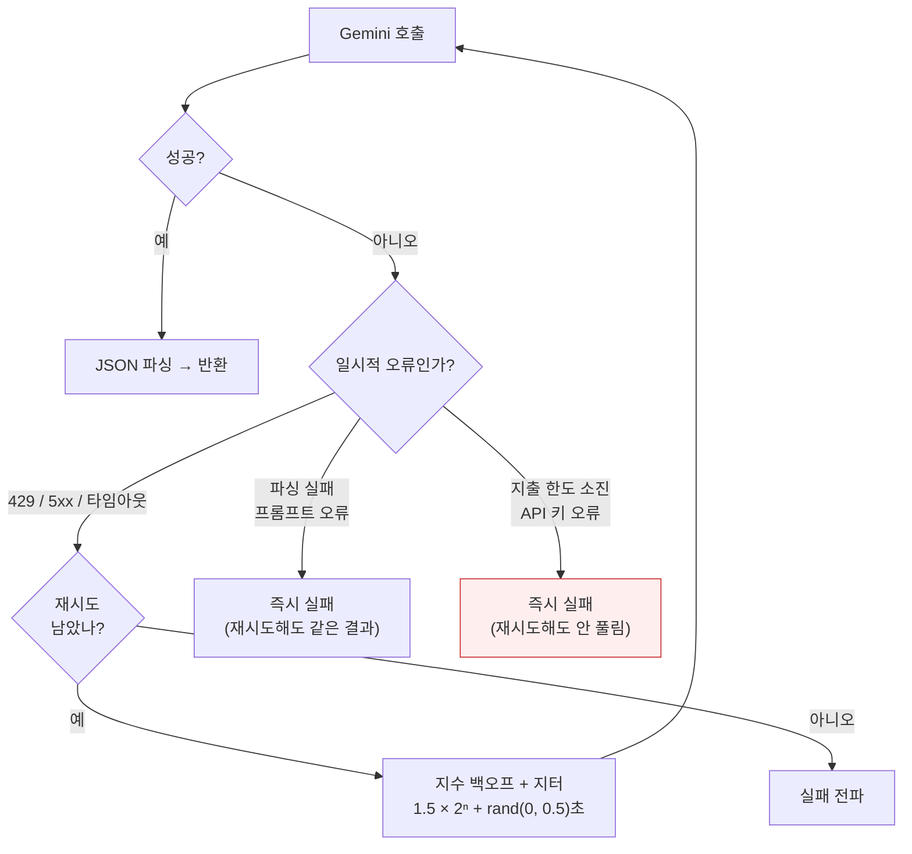

**지출 한도를 일시적 오류에서 제외**한 이유는 실제 사고 때문입니다.
검증 중 프로젝트가 월 지출 한도에 걸렸는데, 같은 429라도 재시도해봐야
풀리지 않고 **호출만 두 배로 나갔습니다.**

```python
if any(k in text for k in ("spending cap", "spend cap", "billing",
                           "exceeded its monthly", "suspended",
                           "api key not valid", "permission denied")):
    return False   # 영구 오류로 취급
```

---

## 8. 토큰 절감 — 응답 형식 축소

### 조사 — 컨텍스트 캐싱은 쓸 수 없었다

"강의 목록을 요청마다 통째로 넣으면 입력 토큰이 폭발한다"는 우려를 측정했습니다.

```
전체 프롬프트    5,085 토큰
  └ 정적 지시문  1,832 토큰 (36%)
  └ 과목 목록    3,253 토큰 (64%, 63개 과목)
요청 1건당 입력  10,333 토큰 (A + B 2회)
```

**전체 데이터를 넣고 있진 않았습니다.** 프론트의 `filterAvailableCourses()`가
학과·학년·이수현황·기피과목으로 미리 걸러 카테고리당 20~30개만 보냅니다.

**컨텍스트 캐싱도 적용할 수 없었습니다.**
재사용 가능한 정적 부분이 1,832 토큰뿐이고, 과목 목록 3,253 토큰은
학생마다 학과·학년·이수현황이 달라 캐시 공유가 불가능합니다.

### 실제 낭비 발견

`reason` 필드가 과목마다 생성되는데 **프론트엔드에서 한 번도 표시되지 않았습니다.**
과목 10개면 한국어 문장 10개를 만들어 그대로 버리고 있었습니다.

### 해결

```
Before: course_name, course_code, section, professor, schedule_raw,
        credits, category, reason  +  total_credits, empty_days
After:  course_name, course_code, section, category
```

- `professor` / `schedule_raw` / `credits` → 서버가 원본 강의 목록에서 채웁니다
- `total_credits` / `empty_days` → 어차피 서버가 재계산하던 값입니다
- 프롬프트의 `reason` 규칙 블록 2개도 제거 (입력 토큰도 절감)

후처리 순서상 `_enrich_courses()`가 충돌 검사보다 **먼저** 실행되므로 안전합니다.

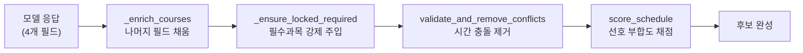

### 검증

```
✅ 서버가 채운 필드가 원본과 일치 (교수·시간·학점·과목명 전수 대조)
✅ 잘못된 course_code는 과목명으로 복구
✅ 옛 형식(전체 필드) 응답도 하위 호환 동작
✅ 실호출 3/3 성공, 필드 정확
```

> **참고:** 응답 시간은 22.2초로 이전 20.4초와 차이가 없었습니다(오차 범위).
> **thinking이 지배적이라 출력 축소로는 시간이 줄지 않습니다.** 토큰 비용만 절감됩니다.

---

## 9. 이탈-재시도 낭비 — 결과 캐시와 요청 합치기

### 문제 구조

사용자가 20~30초를 못 기다리고 이탈했다가 다시 시도하는 패턴에서
**낭비가 두 겹**으로 발생했습니다.

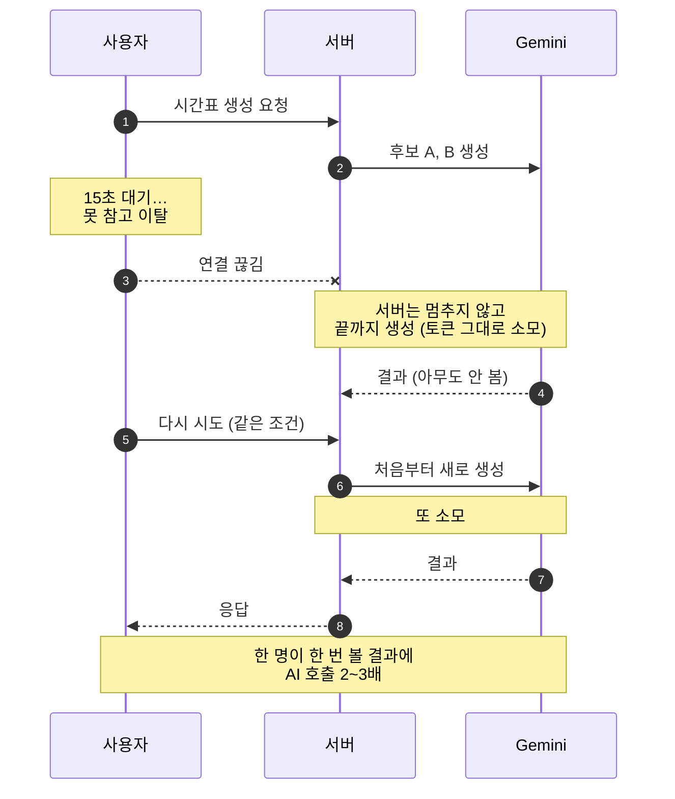

### 해결 — `services/result_cache.py` (신규)

두 가지 장치를 넣었습니다.

**캐시** — 같은 입력이면 5분 안에는 AI를 다시 부르지 않습니다.
이탈 후 재시도는 폼을 똑같이 다시 채우는 흐름이라 입력이 일치합니다.

**합치기(coalescing)** — 아직 생성 중인데 같은 요청이 오면
새로 시작하지 않고 진행 중인 결과를 같이 받습니다.

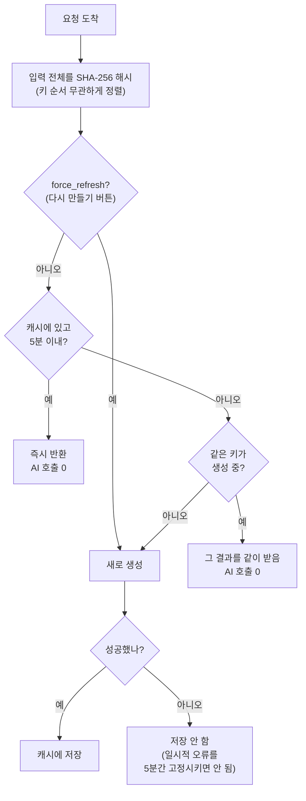

### 검증

```
시나리오: 제출 → 이탈 → 재시도 → 재시도
  3번 시도 모두 200 응답  |  AI 호출 1회  (2회 절약)

시나리오: 동시 제출 3건 (연타 / 새로고침)
  3건 모두 200 응답  |  AI 호출 1회  |  0.41초 (직렬이면 1.2초)

다시 만들기(force_refresh) → 새로 생성 ✅
조건이 하나라도 다르면 새로 생성 ✅
```

**`force_refresh`가 필요한 이유:** '다시 만들기'는 사용자가 *다른* 시간표를 원하는
경우입니다. 캐시를 주면 "안 바뀌네?"가 됩니다. 결과 화면을 한 번이라도 본 뒤에는
프론트가 이 플래그를 켜서 보냅니다.

**합치기 실패 시 폴백:** 합치기는 어디까지나 최적화이므로,
기다릴 수 없는 상황(지연·취소)에서는 에러 대신 **직접 생성**으로 물러납니다.

---

## 10. UI/UX — 기다릴 수 있게 만들기

### 문제

캐시는 **낭비를 막는 것**이지 **느린 걸 고치는 게 아닙니다.**
근본적으로는 사용자가 이탈하지 않게 만들어야 합니다.

기존 로딩 화면은 **정적 스피너 + 고정 문구**뿐이었습니다.

```
┌─────────────────────────┐
│         ◜◝              │   ← 계속 도는 스피너
│  AI가 시간표를 만들고    │
│      있어요             │
│  시간 충돌과 학점 균형을 │
│   확인하는 중이에요     │
└─────────────────────────┘
```

5초 걸릴지 60초 걸릴지 알 수 없으니 이탈하는 게 당연합니다.

### 해결

```
┌─────────────────────────────────┐
│            ◜◝                   │
│   AI가 시간표를 만들고 있어요    │
│      보통 20~30초 걸려요        │  ← 기다릴지 판단할 근거
│                                 │
│  겹치지 않는 조합 찾는 중   12초 │  ← 단계 + 경과 시간
│  ████████░░░░░░░░░░░░░░░        │  ← 진행 막대
│                                 │
│  창을 닫지 말고 잠시만 기다려주세요│
└─────────────────────────────────┘
```

| 요소 | 목적 |
|---|---|
| **예상 시간 명시** ("보통 20~30초") | 기다릴지 판단할 근거를 먼저 준다 |
| **경과 초 + 진행 막대** | 멈춘 게 아니라는 신호 |
| **단계별 문구** (4단계) | 지금 무슨 작업 중인지 알려준다 |
| **30초 초과 시 문구 전환** | "나갔다 다시 시도하면 처음부터 다시 만들어야 해서 더 느려져요" |

마지막 문구가 핵심입니다. **재시도가 손해라는 걸 알려주는 게 가장 직접적인 억제책**입니다.

단계 문구는 경과 시간에 따라 바뀝니다.

```
 0~ 6초  수강 가능한 과목을 추리는 중
 6~14초  시간이 겹치지 않는 조합을 찾는 중
14~24초  학점과 공강을 맞춰보는 중
24~40초  거의 다 됐어요, 마무리하는 중
40초~    조금만 더 기다려주세요
```

---

## 11. 프론트엔드 — Firestore 중복 조회 제거

`CourseSearchModal`에서 세 가지 문제를 발견했습니다.

### 문제 1 — 부모 리렌더마다 쿼리 재발행

```jsx
// 호출부: 렌더마다 새 객체가 만들어진다
<CourseSearchModal filterOptions={{ category: 'major', department: userInfo.major }} />

// 모달 내부: filterOptions가 의존성에 있어 매번 effect 재실행
useEffect(() => { ... }, [searchTerm, isOpen, searchCourses, filterOptions]);
```

부모(`RecommendPage`)의 **어떤 state가 바뀌어도** 새 객체가 생성되어
모달이 열려 있으면 Firestore 쿼리가 다시 나갔습니다.

```jsx
// 해결: 내용이 실제로 바뀔 때만 새 객체가 되도록 고정
const filterKey = JSON.stringify(filterOptions);
const filters = useMemo(() => JSON.parse(filterKey), [filterKey]);
```

### 문제 2 — 중복 초기 로드

모달을 열 때 두 개의 `useEffect`가 **각각 쿼리를 발행**해 요청이 2배였습니다.
두 번째 effect는 첫 번째가 이미 하는 일이라 제거했습니다.

### 문제 3 — 타이핑 한 글자마다 쿼리

2글자 이상이면 키 입력마다 Firestore를 조회했습니다.
**300ms 디바운스**를 넣고, 늦게 도착한 이전 응답이 최신 결과를 덮어쓰지 않도록
취소 플래그를 추가했습니다.

```jsx
let cancelled = false;
(async () => {
  const results = await searchCourses(query);
  if (!cancelled) setSearchResults(results);
})();
return () => { cancelled = true; };
```

---

## 12. 실험 기록 — 모델 교체 검토

### 배경

thinking 토큰이 요청당 4,000~6,000개로 **비용과 지연 양쪽을 지배**한다는 것을
확인한 뒤, 더 가벼운 모델로 바꿀 수 있는지 검토했습니다.

### 실험 1 — flash vs flash-lite

케이스 3개(의생명과학과 3학년 / 간호학과 2학년 / 컴퓨터공학전공 3학년) × 2회.
서버 보정 **전** 원본 응답을 가로채 실제 정확도를 측정했습니다.

| 지표 | `gemini-flash-latest` | `gemini-flash-lite-latest` |
|---|---|---|
| 응답 시간 (중앙값) | 21.9초 | **2.1초** |
| thinking 토큰 | 7,970 | **0** |
| 점수 (중앙값) | **100** | 28 |
| 목표학점 오차 (평균) | **0.67학점** | 3.83학점 |
| 시간 충돌 (합계) | **0건** | 8건 |
| 후보 수 (평균) | **2.0** | 1.5 |
| 잘못된 course_code | 0 | 0 |
| 중복 선택 | 0 | 0 |
| 입력 토큰 | 10,795 | 10,795 |

**결론: flash-lite 단독 교체는 불가.**

- 18학점 요청에 **12~16학점**이 나옵니다
- 6회 중 3회에서 시간 충돌을 냈습니다 (총 8건)
- 금요일 공강 요청을 **완전히 무시한 경우가 2번** (점수 0)
- 요청 공강 미충족으로 후보가 걸러져 1개만 남는 경우가 2번

흥미로운 점은 **형식은 오히려 깔끔했다**는 것입니다.
잘못된 course_code 0건, 중복 0건. JSON 모드 덕입니다.
**못하는 건 "형식"이 아니라 "조합 문제 풀기"** 입니다.

### 실험 2 — thinking 제어 파라미터 확인

thinking 예산을 직접 제어해보려 했으나, 첫 시도에서 값이 무시됐습니다.

```
기본(무제한)              24.1s | thinking 5,061
thinking_budget=1024     26.9s | thinking 6,086   ← 무시됨
thinking_level=low       12.9s | thinking 2,530   ← 먹힘
thinking_level=high      22.2s | thinking 4,659
```

**`gemini-flash-latest`는 Gemini 3 계열이라 `thinking_budget`(2.5 시절 파라미터)을
무시하고 `thinking_level`을 따릅니다.**

추가로 **flash-lite는 `thinking_level`을 줘도 thinking이 0**이었습니다.
"싼 모델 + thinking 켜기" 조합은 성립하지 않습니다.

```
flash-lite 기본        1.7s | thinking 0
flash-lite low         1.9s | thinking 0
```

### 실험 3 — thinking_level 스윕

케이스 3개 × 3회 = 27요청.

| 설정 | 시간(중앙) | 점수(중앙) | 점수(평균) | 학점차 | 충돌 | thinking |
|---|---|---|---|---|---|---|
| flash / `low` | **13.3초** | 100 | 92 | 1.33 | 10건 | 3,314 |
| flash / 기본 | 23.6초 | 100 | **100** | 0.56 | **0건** | 8,236 |
| flash / `high` | 31.5초 | 100 | **100** | 0.33 | **0건** | 11,968 |

**`high`는 즉시 탈락** — 기본값보다 느리고 thinking을 1.5배 쓰는데 품질은 같습니다.
기본값이 이미 `high`보다 낮은 지점에 있었습니다.

**`low`는 중앙값이 품질 저하를 가립니다.** 케이스별로 보면 명확합니다.

```
             의생명과학과      간호학과        컴퓨터공학
low   점수    100/100/100   100/64/64     100/100/100
      충돌      0/0/0        1/4/1          2/2/0
기본  점수    100/100/100  100/100/100    100/100/100
      충돌      0/0/0        0/0/0          0/0/0
```

**어려운 케이스(간호학과)에서 무너집니다.** 전공필수가 요일에 빽빽하게 박혀
제약이 빡빡한 학과인데, 정확히 거기서 생각을 덜 하면 답을 못 찾습니다.
기본값에서도 간호학과가 30~43초로 가장 오래 걸리던 케이스였습니다.
**오래 걸리는 이유가 실제로 어려워서였고, 그 시간을 뺏으면 품질이 나갑니다.**

결정적으로 한 실행에서:

```
간호학과 #2   4.4초  점수64  충돌4  thinking 0
```

**`low`가 thinking을 아예 0으로 떨어뜨린 경우가 있습니다.**
하한이 보장되는 설정이 아니라 가끔 flash-lite와 같은 상태가 됩니다.

### 결정

**현재 설정(기본값) 유지.** 다만 언제든 실험할 수 있도록
`GEMINI_THINKING_LEVEL` 환경변수로 빼두었습니다.
재배포 없이 값만 바꿔 실사용자 대상 A/B가 가능합니다.

> `low`의 유일한 매력은 **긴 꼬리를 잘라낸다**는 점입니다.
> 기본값은 15.0~43.1초로 분포하지만 `low`는 4.4~17.3초입니다.
> 이탈은 43초 같은 케이스에서 터지므로, 나중에 적응형(low 먼저 → 품질 미달 시 기본값 재생성)을
> 검토할 여지가 있습니다.

---

## 13. SDK 이전 — google-genai

### 배경

`google-generativeai`는 **지원이 종료된 패키지**입니다.
import 시 다음 경고가 출력됩니다.

```
FutureWarning: All support for the `google.generativeai` package has ended.
It will no longer be receiving updates or bug fixes.
```

thinking 설정 실험을 위해서도 새 SDK가 필요했습니다.

### 이전 내용

| 항목 | Before (`google-generativeai`) | After (`google-genai`) |
|---|---|---|
| 진입점 | `genai.configure()` + `GenerativeModel` 인스턴스 | `genai.Client()` 싱글턴 |
| 비동기 | 없음 (`asyncio.to_thread`로 우회) | **네이티브 `client.aio`** |
| 타임아웃 | `RequestOptions(timeout=90)` — 초 | `HttpOptions(timeout=90_000)` — **밀리초** |
| `finish_reason` | 정수 (`2` = MAX_TOKENS) | **문자열 enum** (`FinishReason.MAX_TOKENS`) |
| thinking 제어 | 불가 | `ThinkingConfig(thinking_level=...)` |
| thinking 토큰 관측 | 총합에서 역산 | `usage_metadata.thoughts_token_count` |

### 함께 잡은 실제 버그 — 이벤트 루프 블로킹

이전 과정에서 **`evaluate_schedule`과 `modify_schedule`이 `async def`인데
Gemini를 동기로 호출**하고 있다는 것을 발견했습니다.

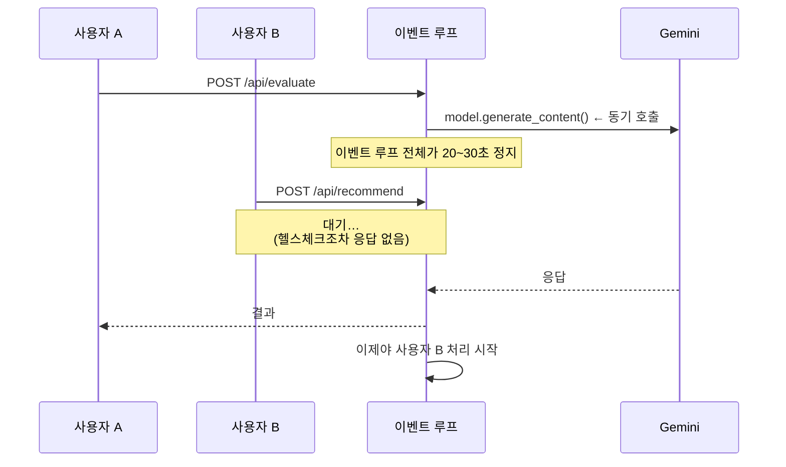

추천 경로만 `asyncio.to_thread`로 우회하고 있었고, 평가·수정은 그대로였습니다.
Rate limit을 붙여 동시 사용자가 늘어날 수 있는 상황이라 제때 잡힌 셈입니다.

**측정으로 확인:**

```
AI 호출 중 다른 코루틴 실행 횟수: 36회   (막혀 있으면 0)
```

### 구조 정리 — `services/gemini.py` (신규)

호출 규칙이 3개 파일에 흩어져 있어, `max_output_tokens`를 5곳에서
따로 고쳐야 했습니다(실제로 이것이 §3 버그의 원인이었습니다).

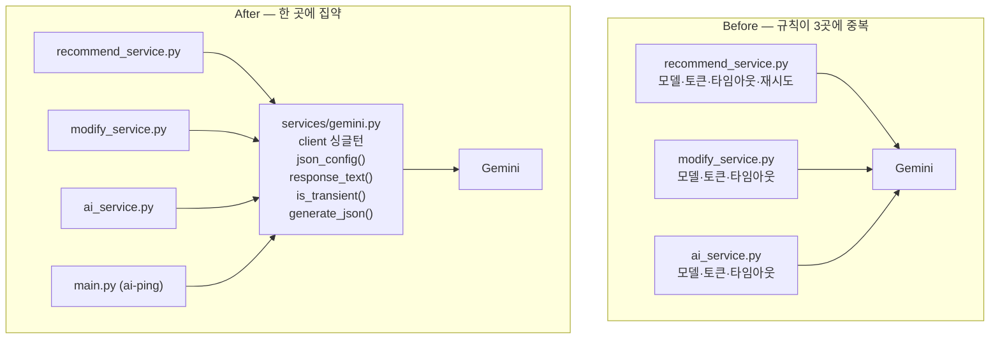

`recommend_service.py`는 **212줄 줄었습니다.**

### 검증

```
추천 (실호출 4회)      19.6초 중앙값 | 4/4 성공 | 후보 2개 | 점수 100
평가                   ✅ 13.1초 | 점수 91
수정                   ✅  9.5초
복수전공 split 경로     ✅ 39.0초 | 19학점 | 주전공+복전+교양 모두 포함
ai-ping                ✅  1.7초
동시성                 ✅ AI 호출 중 다른 작업 36회 실행
오프라인 테스트 7종      전부 통과
```

---

## 14. 테스트로 잡은 버그

작업 중 작성한 테스트가 **실제 결함 3건**을 찾아냈습니다.

### 1) `Retry-After` 헤더 오계산 + `IndexError`

```python
# Before
retry_after = int(window - (now - dq[0])) + 1
```

`dq[0]`는 **가장 긴 시간창 기준 가장 오래된 기록**입니다.
분당/시간당 규칙이 함께 있으면 엉뚱한 값이 나오고,
한도가 0이면 빈 deque를 인덱싱해 `IndexError`로 터졌습니다.

```python
# After — 해당 규칙의 시간창 안에서 계산
if limit <= 0:
    retry_after = int(window)
else:
    oldest_blocking = in_window[len(in_window) - limit]
    retry_after = max(1, int(window - (now - oldest_blocking)) + 1)
```

### 2) 요청 합치기 실패 시 504 반환

합치기를 기다릴 수 없는 상황에서 사용자에게 504를 뱉고 있었습니다.
합치기는 **최적화일 뿐**이므로 실패하면 직접 생성으로 물러나야 맞습니다.

```python
except (asyncio.TimeoutError, asyncio.CancelledError, RuntimeError):
    result = await factory()   # 에러 대신 직접 생성
```

### 3) 후보 B가 요청 공강을 맞바꿈

§4에 기술. 점수 0짜리 후보가 사용자에게 노출되던 문제입니다.

---

## 15. 환경변수

재배포 없이 동작을 바꿀 수 있도록 주요 설정을 환경변수로 노출했습니다.

| 변수 | 기본값 | 설명 |
|---|---|---|
| `GEMINI_MODEL` | `gemini-flash-latest` | 사용 모델 |
| `GEMINI_THINKING_LEVEL` | (미설정) | `low` \| `high` \| 미설정(모델 기본) |
| `GEMINI_MAX_OUTPUT_TOKENS` | `32768` | thinking + 답변 합산 예산 |
| `GEMINI_TIMEOUT` | `90` | 호출 타임아웃(초) |
| `DAILY_AI_LIMIT` | `500` | AI 호출 일일 상한 |
| `RESULT_CACHE_TTL` | `300` | 결과 캐시 유지 시간(초) |
| `RESULT_CACHE_MAX` | `200` | 캐시 최대 항목 수 |
| `RESULT_CACHE_WAIT` | `120` | 진행 중인 요청 최대 대기(초) |

현재 적용된 설정은 `/health`에서 확인할 수 있습니다.

```json
{
  "status": "healthy",
  "api_key_configured": true,
  "rate_limit": { "daily_ai_calls": 12, "daily_ai_limit": 500, "tracked_ips": 3 },
  "result_cache": { "hit": 4, "coalesced": 1, "miss": 7, "saved_ratio": 0.417 },
  "model": { "name": "gemini-flash-latest", "thinking_level": "기본" }
}
```

---

## 16. 배포 체크리스트

### 신규 파일

```
dju-timetable-api/services/gemini.py         Gemini 호출 공통 모듈
dju-timetable-api/services/rate_limit.py     IP별 제한 + 일일 상한
dju-timetable-api/services/result_cache.py   결과 캐시 + 요청 합치기
```

### 수정 파일

```
dju-timetable-api/main.py                    rate limit·캐시 연결, ai-ping 이전
dju-timetable-api/models/schemas.py          force_refresh 필드 추가
dju-timetable-api/requirements.txt           google-generativeai → google-genai
dju-timetable-api/services/recommend_service.py
dju-timetable-api/services/modify_service.py
dju-timetable-api/services/ai_service.py
dju-timetable/src/pages/RecommendPage.jsx    로딩 UI, 실패 로그, 검색 모달
dju-timetable/src/pages/AIPage.jsx           실패 로그
dju-timetable/src/pages/AdminPage.jsx        실패 원인 표시
dju-timetable/src/services/aiService.js      force_refresh 전달
dju-timetable/src/services/aiLogService.js   error 필드
```

### 주의사항

> **`requirements.txt`가 바뀌었습니다.** `google-generativeai` → `google-genai`.
> 호스팅에서 의존성을 **다시 설치**해야 합니다. 캐시된 빌드를 쓰는 설정이면
> 새로 빌드하도록 확인해주세요. 이것이 누락되면 임포트부터 실패합니다.

- 백엔드 재배포 후 `/health`로 `model.name` 확인
- 프론트엔드(Vercel) 재배포
- 관리자 페이지에서 성공률이 100% 아래로 내려가는 것은 **정상**입니다 (§5 참조)

---

## 17. 남은 과제

### 인증

`GET /api/health/ai-ping`이 여전히 **인증 없이 Gemini를 호출**시킬 수 있습니다.
빈도 제한과 일일 상한으로 피해를 묶어뒀을 뿐입니다.
백엔드에 `firebase-admin`을 추가해 관리자 토큰을 검증하는 것이 근본 해결입니다.

### 응답 시간

19.6초는 개선됐지만 여전히 짧지 않습니다. 남은 지연의 대부분은
thinking 토큰(4,000~6,000)입니다. 검토 가능한 방향:

- **적응형 thinking** — `low`로 먼저 생성하고, 충돌이 있거나 점수가 기준 미달이면
  기본값으로 재생성. 기대값 약 18초에 품질은 기본값 수준.
  판정에 필요한 `score_schedule()`과 `validate_and_remove_conflicts()`는 이미 있습니다.
- **점진적 응답** — 후보 A만 먼저 반환하고 B는 뒤이어 붙이기 (SSE 또는 2단계 요청)

### 확장성

`rate_limit`과 `result_cache`는 **메모리 기반**이라 인스턴스 1대를 전제합니다.
여러 인스턴스로 늘리면 Redis 같은 공유 저장소로 옮겨야 합니다.

### 관찰성

캐시 절감률(`saved_ratio`)과 일일 사용량이 `/health`에만 노출됩니다.
관리자 페이지에 추이 그래프로 올리면 효과를 지속적으로 볼 수 있습니다.

---

## 부록 — 전체 요청 흐름 (최종)

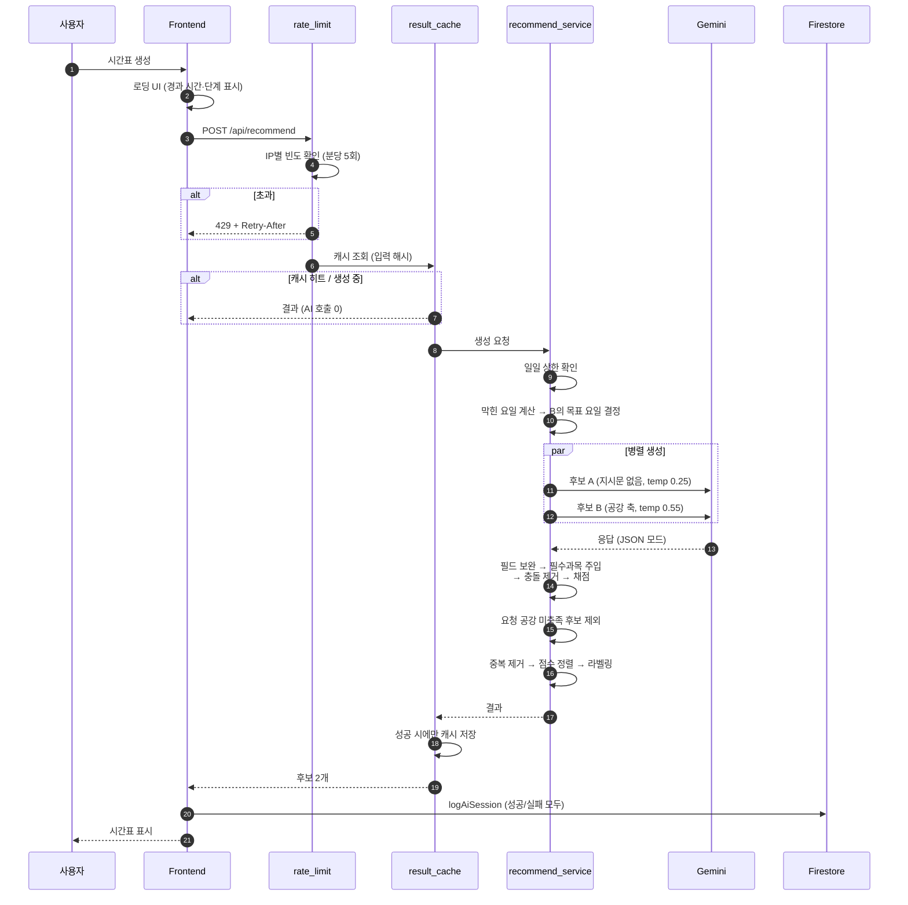
