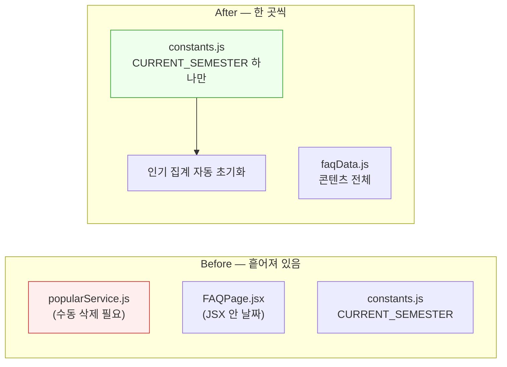
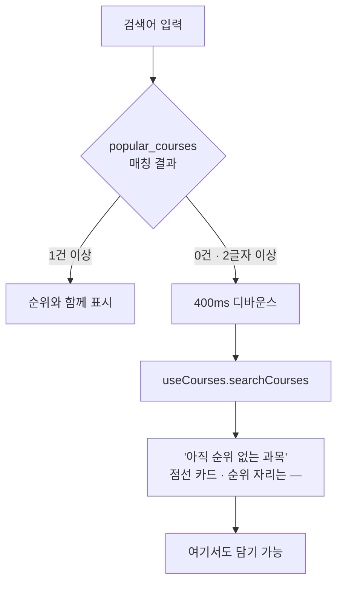

# 대진대 시간표 — Release Notes v4.0 (디자인 통일 · 2학기 전환 · 피드백 반영)

> 2026년 7월 28일 작업 기준. v3.0(AI 성능·안정성)에 이어 진행한 작업입니다.
>
> v3이 백엔드와 AI 파이프라인을 다뤘다면, v4는 **프론트엔드 일관성**, **학기 전환 대응**,
> **사용자 피드백 반영**을 다룹니다. 화면을 다시 그린 작업이 대부분이지만,
> 학기가 바뀔 때 반복해서 손봐야 했던 구조를 함께 정리했습니다.

---

## 목차

1. [한눈에 보기](#1-한눈에-보기)
2. [헤더 중복 — 공용 컴포넌트로 통일](#2-헤더-중복--공용-컴포넌트로-통일)
3. [업데이트 내역 페이지 리디자인](#3-업데이트-내역-페이지-리디자인)
4. [인기 과목 페이지 리디자인](#4-인기-과목-페이지-리디자인)
5. [인기 집계가 학기를 넘어 누적되던 문제](#5-인기-집계가-학기를-넘어-누적되던-문제)
6. [졸업계산기 → 학점 플래너](#6-졸업계산기--학점-플래너)
7. [학점 플래너 리디자인](#7-학점-플래너-리디자인)
8. [FAQ 리디자인 — 콘텐츠 데이터화와 탭 분리](#8-faq-리디자인--콘텐츠-데이터화와-탭-분리)
9. [FAQ 2학기 내용 반영](#9-faq-2학기-내용-반영)
10. [과목 검색 — 겹치는 과목 숨기기](#10-과목-검색--겹치는-과목-숨기기)
11. [AI평가 임시 비노출](#11-ai평가-임시-비노출)
12. [첫 진입 팝업 제거](#12-첫-진입-팝업-제거)
13. [방문자 지표 — Vercel Analytics](#13-방문자-지표--vercel-analytics)
14. [자잘한 수정](#14-자잘한-수정)
15. [배포 체크리스트](#15-배포-체크리스트)
16. [남은 과제](#16-남은-과제)

---

## 1. 한눈에 보기

### 변경 요약

| 항목 | Before | After |
|---|---|---|
| 페이지 헤더 | 6개 페이지에 각각 복붙 (스타일 4종) | `SiteHeader` 1개 컴포넌트 |
| 내비 항목 정의 | HomePage · UpdateLogPage에 중복 | `data/nav.js` 단일 소스 |
| 인기 집계 | 학기 구분 없이 누적 | 학기별 분리 (`semester` 필드) |
| 인기 과목 페이지 | select 3개 + 단순 리스트 | 검색 · 칩 필터 · TOP3 · 폴백 |
| 졸업계산기 | 이름/주소가 기능과 불일치 | `학점 플래너` · `/credits` |
| FAQ 콘텐츠 | JSX 안에 하드코딩 | `data/faqData.js` 블록 데이터 |
| FAQ 범위 | 학사 정보만 (19문항) | 학사 26 + 사이트 이용 16 |
| FAQ 기준 학기 | 2026-1 (낡음) | 2026-2 |
| 검색 결과 | 겹치는 과목도 전부 노출 | 숨기기 토글 (기본 꺼짐) |
| 방문자 지표 | 패키지만 설치, 미연결 | `<Analytics />` 연결 |

### 학기 전환 시 손봐야 할 곳

이번 작업의 목표 중 하나는 **학기가 바뀔 때 고칠 파일 수를 줄이는 것**이었습니다.



---

## 2. 헤더 중복 — 공용 컴포넌트로 통일

### 문제

같은 사이트인데 페이지마다 헤더가 달랐습니다.

| 페이지 | 헤더 |
|---|---|
| 홈 | 로고 + 내비 + 모바일 햄버거 |
| 업데이트 · 인기 | 로고 + 내비 (활성 알약) — 마크업 복붙 |
| 피드백 · FAQ | `shadow-sm` + 뒤로가기 + 아이콘 + 제목 (구 스타일) |
| 학점 플래너 | 인라인 스타일 `←` 버튼 |

`NAV_ITEMS` 배열도 HomePage와 UpdateLogPage에 각각 복사돼 있어서,
내비를 한 곳만 고치면 다른 쪽이 어긋나는 상태였습니다.

### 해결 — `components/SiteHeader.jsx` (신규)

```jsx
<SiteHeader activeHref="/popular" title="인기 과목" badge={CURRENT_SEMESTER} />
```

| prop | 역할 |
|---|---|
| `activeHref` | 현재 페이지를 내비에서 알약으로 강조 |
| `title` | 있으면 모바일에 뒤로가기 + 제목, 없으면(홈) 로고 + 햄버거 |
| `badge` | 제목 옆 배지 (인기 페이지의 학기 표시) |
| `right` | 페이지별 우측 버튼 (관리자 톱니 등) |

활성 색은 `/popular`만 주황(`#FFF1E8` / `#E2670F`), 나머지는 파랑(`#EAF1FE` / `#2F6FEB`)입니다.
디자인 시안이 인기 페이지에만 주황을 쓰기 때문입니다.

적용: 홈 · 피드백 · 업데이트 · FAQ · 학점 플래너 · 인기 **6개 페이지**.
`data/nav.js`를 만들어 `NAV_ITEMS` 중복도 제거했습니다.

> 관리자 3종(`/admin`, `/feedback/admin`, `/updates/admin`), 공유 페이지, 404, AI 추천은
> 내비를 노출할 자리가 아니라 기존 헤더를 유지했습니다.

---

## 3. 업데이트 내역 페이지 리디자인

`/updates` · `UpdateLogPage.jsx`

### 변경

| 요소 | Before | After |
|---|---|---|
| 구조 | 좌측 타임라인 선 + 점 | 버전 인덱스 사이드바 + 릴리스 스트림 |
| 요약 | 그라데이션 배너 | 흰 카드 + 통계 3칸 (업데이트 수 / 변경사항 수 / 최신 배포 경과일) |
| 변경사항 | 태그 + 한 줄씩 나열 | 타입별로 묶어서 그룹 렌더 |
| 필터 | 없음 | 타입 필터 (새 기능 / 개선 / 수정 / 출시) |

### 데이터 처리

- `update.date`(관리자 폼이 `YYYY-MM-DD`로 저장)를 우선 파싱하고, 없으면 `createdAt`으로 폴백
- "N일 전 최신 배포"는 최신 버전 날짜로 계산 (오늘 / 어제 처리 포함)
- 타입 필터 선택 시 해당 타입이 없는 버전 카드는 숨기고, 펼친 카드 안에서도 그 타입 그룹만 표시

Firestore 스키마는 건드리지 않았습니다.

---

## 4. 인기 과목 페이지 리디자인

`/popular` · `PopularPage.jsx`

디자인 시안이 4개 턴으로 나뉘어 있어 순서대로 반영했습니다.

### 4-1. 기본 구조

- 페이지 헤더 + 통계 3칸 (`명의 담은 기록` / `개 과목 집계` / `5분 주기 갱신`)
  - "5분 주기"는 `popularService`의 `CACHE_DURATION`과 실제로 일치합니다
- select 3개 → **구분 칩 + 영역 칩**
- 데스크톱: TOP 3 카드 그리드 + 순위 표 (`56px 1fr 150px 132px 168px 96px`)
- 모바일: 순위 카드 리스트
- 담은 인원 막대 — 1위 `#E2670F`, 나머지 `#F0913F`

### 4-2. 전공 필터

- 데스크톱: 단과대 칩 → 선택 시 학과 칩 노출, 미선택이면 "단과대학을 먼저 선택하세요"
- 모바일: 드롭다운 2개 + **바텀시트** (영역 · 단과대 · 학과 공용 컴포넌트)
- 학과 미선택 시 점선 안내 카드

### 4-3. 검색

**순위를 먼저 매기고 그 위에서 거르는** 순서가 핵심입니다.

```js
const ranked = courses.map((course, index) => ({ course, rank: index + 1 }));
const matches = ranked.filter(({ course }) => /* 검색어 매칭 */);
```

이렇게 해야 "데이터과학 입문"을 검색해도 **전체 4위**라는 정보가 유지됩니다.
검색 결과 순서대로 1, 2, 3을 다시 매기면 순위 페이지의 의미가 사라집니다.

- 자동완성 드롭다운 (순위 태그 · 검색어 하이라이트 · 담은 인원)
- 최근 검색어 칩 (`dju_popular_recent`)
- 결과 1건이면 상세 카드 + `같은 시간대에 많이 담긴 다른 과목`
  - `timeUtils.isTimeConflict`로 실제 시간 겹침을 계산

### 4-4. 전체 과목 폴백

인기 집계에 없는 과목을 검색했을 때 "결과 없음"으로 끝나면 안 됩니다.
아직 아무도 담지 않았을 뿐 개설은 돼 있을 수 있기 때문입니다.



### 시안에서 제외한 것

TOP 3 카드의 `잔여 12 / 정원 60`은 넣지 못했습니다.
`popular_courses`·`courses` 어디에도 정원·잔여석 필드가 없습니다.
그 자리에는 강의실(없으면 `학수번호-분반`)을 넣었습니다.

---

## 5. 인기 집계가 학기를 넘어 누적되던 문제

### 문제

`popular_courses`의 문서 ID가 `{학수번호}-{분반}` 형식이라 **학기 구분이 없었습니다.**
2학기가 시작돼도 1학기 담기 횟수가 그대로 순위에 남아 혼란을 줍니다.

### 선택지

| 안 | 내용 | 문제 |
|---|---|---|
| 전부 삭제 | 문서를 지우고 다시 시작 | 다음 학기에 또 수동 작업 |
| **학기별 분리** | ID에 학기 접두사 + `semester` 필드 | 없음 — 채택 |

### 해결 — `popularService.js`

```js
function popularDocId(courseCode, section) {
  return `${CURRENT_SEMESTER}_${courseCode}-${section}`;
}
```

| 변경 | 내용 |
|---|---|
| 문서 ID | `561041-03` → `2026-2_561041-03` |
| 새 문서 | `semester: CURRENT_SEMESTER` 필드 저장 |
| 조회 | `where('semester', '==', CURRENT_SEMESTER)` |

증가·감소 양쪽 모두 같은 함수를 쓰므로 호출부(`useSchedule.js`)는 수정하지 않았습니다.

### 결과

- 2학기 순위가 0부터 시작합니다
- 1학기 문서는 **삭제하지 않았고**, 학기 필드가 없어 쿼리에 걸리지 않습니다
- 다음 학기부터는 `CURRENT_SEMESTER` 한 줄만 바꾸면 자동으로 새로 집계됩니다

> `semester` 단일 필드 equality 쿼리라 Firestore 자동 색인으로 동작합니다. 복합 색인 불필요.
>
> 1학기에 담은 과목을 아직 시간표에 갖고 있는 사용자가 삭제하면, 없는 2학기 문서에 감소 요청이
> 나가지만 기존 코드가 "문서 없음"으로 스킵하므로 카운트가 음수로 가지 않습니다.

---

## 6. 졸업계산기 → 학점 플래너

### 문제

이름과 기능이 어긋나 있었습니다. 이 페이지가 실제로 하는 일은
**이수 학점을 입력받아 남은 학기별 권장 수강학점을 계산**하는 것입니다.
"졸업계산기"는 졸업 가능 여부만 따지는 도구처럼 읽힙니다.

### 변경

| 대상 | Before | After |
|---|---|---|
| 내비 라벨 | 졸업계산기 | **학점 플래너** |
| 주소 | `/graduation` | `/credits` |
| 페이지 제목 | 졸업요건 계산기 | 학점 플래너 |
| 부제 | 대진대학교 | 지금까지 들은 학점을 넣으면, 남은 학기마다 몇 학점씩 들어야 하는지 알려드려요 |

기존 링크 보존을 위해 리다이렉트를 넣었습니다.

```jsx
<Route path="/credits" element={<CreditPlanner />} />
<Route path="/graduation" element={<Navigate to="/credits" replace />} />
```

백엔드 엔드포인트 `/api/graduation/validate`, `/api/graduation/plan`은 그대로입니다.
실제로 졸업요건을 계산하는 API라 이름이 맞고, 바꾸면 서버도 같이 배포해야 합니다.

---

## 7. 학점 플래너 리디자인

`/credits` · `Graduationcalculator.jsx`

**계산 로직은 전부 유지**했습니다. 화면만 다시 그렸습니다.

| 유지 | 변경 |
|---|---|
| `buildRequestBody` | 인라인 스타일 → Tailwind |
| `getReq` (학번별 졸업 기준) | 이모지 제거, 라인 아이콘 + 컬러 토큰 |
| `canNext` 검증 규칙 | 드롭다운 5개 → 세그먼트 버튼 |
| 상태 3종 | `<table>` → 그리드 (입력칸 52px · 숫자 19px) |
| API 2회 호출 | 4단계 스텝 레일 (완료 단계 클릭 시 되돌아가기) |

### 결과 화면 재배치

가장 중요한 정보를 위로 올렸습니다.

```
① 졸업까지 N학점 남았어요 · M학기 동안   ← 진행 바 + 학기 평균
② 학기별 수강 계획 (막대 그래프)
③ 요건 4칸 (졸업 총학점 / 전공 / 교필 / 교선)
④ 교양영역 그리드
⑤ 확인 사항
```

⑤는 시안에 없는 블록입니다. 백엔드가 `validation.warnings` / `plan.warnings`로
"상한 초과 → 초과학기 필요", "학점 포기제 활용" 같은 실질적인 안내를 내려주는데
버리면 정보 손실이라 시안의 주의 카드 스타일로 넣었습니다.

---

## 8. FAQ 리디자인 — 콘텐츠 데이터화와 탭 분리

`/faq` · `FAQPage.jsx` + `data/faqData.js` (신규)

### 문제 1 — 콘텐츠가 JSX 안에 있었음

22개 질문의 답변이 전부 JSX였습니다. 표는 `<table className="w-full border-collapse...">`,
강조는 `<div className="bg-red-50 border...">` 식으로 **질문마다 서식이 제각각**이었고,
학기가 바뀌어 내용을 갈아끼우려면 마크업을 통째로 다시 써야 했습니다.

### 해결 — 블록 데이터

```js
{ q: '예비수강신청(장바구니)이 뭐예요?', blocks: [
  P('수강신청 전에 원하는 과목을 미리 담아두는 기능이에요.'),
  UL(['최대 24학점까지 담을 수 있어요', ...]),
  CO('warn', '담아둔 것만으로는 신청이 되지 않아요...'),
]}
```

| 헬퍼 | 렌더 |
|---|---|
| `P(text, { strong })` | 문단 |
| `UL([...])` / `OL([...])` | 목록 (• / 1. 2. 3.) |
| `TB(cols, head, rows)` | 표 (`cols`는 grid-template-columns) |
| `CO(tone, text)` | 강조 박스 — `warn` `info` `ok` `accent` |
| `ST([{n, title, desc}])` | 번호 단계 카드 |

학기마다 바뀌는 배지·요약 수치·각주는 `COURSE_META` 한 곳에 모았습니다.

### 문제 2 — 이 페이지의 정체성

"FAQ"인데 내용이 전부 학사 정보였습니다. 사이트 사용법 질문은 하나도 없었습니다.
어느 쪽이 맞는지 검토한 결과, **학사 정보를 유지하는 것이 맞다**고 판단했습니다.

- 시간표에 과목 담는 법은 화면을 보면 알지만, "전필/전선이 뭐예요"는 화면으로 답할 수 없음
- 학사 정보는 포털·공지·PDF에 흩어져 있고 검색이 안 됨 — 한 페이지로 모은 것 자체가 가치
- 학점 플래너·인기 과목 필터가 이 지식(이수구분 구분)을 전제로 함

다만 사이트 질문이 없지는 않아서 **탭으로 분리**했습니다.

| 탭 | 문항 | 성격 |
|---|---|---|
| 수강신청 안내 | 26 | 학교 공지 기준 |
| 사이트 이용 | 16 | 서비스 자체 문의 |

### 기능

검색(질문·카테고리·답변 본문 전체) · 카테고리 필터(데스크톱 sticky 사이드바 / 모바일 칩) ·
전체 펼치기·접기 · 결과 요약줄 · 결과 없음 상태 · 하단 학사팀 연락처(모바일은 `tel:` 링크).

### 사실관계 수정

시안의 사이트 탭에 "시간표는 서버로 전송되지 않아요"가 있었는데 사실과 달랐습니다.

| 실제 동작 | |
|---|---|
| 시간표 저장 | localStorage (서버 전송 없음) |
| 공유 링크 · 전송 코드 | **Firestore에 업로드됨** (사용자가 직접 누를 때만) |
| 과목 담기 | **인기 집계 카운트 증가** (익명, 숫자만) |

개인정보 관련 문구라 실제 동작대로 고쳤습니다.

### 피드백 게시판 질문 반영

실제로 들어온 문의를 추가했습니다.

> **링크를 공유하면 다른 사람이 제 시간표를 볼 수 있나요?**
> 네, 보기만 가능하고 수정은 할 수 없습니다.

관리자 답변의 두 핵심은 유지하고, 코드를 확인해 두 가지를 덧붙였습니다.

- **스냅샷** — `saveScheduleForShare`가 공유할 때마다 새 문서를 만들어 그 시점 과목을 저장합니다.
  나중에 시간표를 고쳐도 이미 뿌린 링크는 안 바뀝니다.
- **비밀번호 없음** — 6자리 ID만 알면 누구나 열립니다.

---

## 9. FAQ 2학기 내용 반영

학교 수강신청 안내 PDF(6쪽)를 읽고 반영했습니다.

### 일정

| 구분 | Before (1학기) | After (2학기) |
|---|---|---|
| 예비수강신청 | 2.3 ~ 2.4 | **8.12(수) 10:00 ~ 8.13(목) 17:00** |
| 수강신청 | 2.9 ~ 2.11 | **8.19(수) 10:00 ~ 8.21(금) 17:00** |
| 수강신청 변경 | 3.3 ~ 3.9 | **9.1(화) 10:00 ~ 9.7(월) 17:00** |
| 폐강과목 수강변경 | (없음) | **9.8(화) 10:00 ~ 9.10(목) 17:00** |

2학기 공지에는 신입생/재학생 구분이 없어 하나로 합쳤습니다.

### 기존 답변 보강

| 질문 | 보강 내용 |
|---|---|
| 수강 가능 학점 | "2026학번 기준" → **학번별 전체 표** (2011 이하 / 2012~2017 / 2018~2024 / 2025 이상) |
| 교양 최대 인정 | "32~42학점" → 학번별 표 (2012~2015: 40 / 2016~2024: 46 / 2025 이상: 42) |
| 재수강 | **교과목당 2회 제한**(F 예외), **"재수강 안내창"이 안 뜨면 재수강 처리 안 됨** |
| 이월제도 | "2학점 이하 미신청학점", 자동 반영·미사용 시 소멸, 제외 대상 5종 |
| 비고란 | 미준수 시 신청 내역 예고 없이 삭제, 소속 학과 지정 분반 강제 |
| 전필/전선 | 이수구분 약어 **9종 전체표** (교필·교선·전기·전필·전선·일선·복전·부전·마전) |
| 당일 준비 | "대안 2~3개" → 공지 문구대로 **"교양선택 3~5개 추가 준비"** |
| 서버 지연 | "매크로 300회 징계"(근거 없음) → **"규정 위반 시 부분 삭제·임의 정정"**(공지 근거) |

기존의 교양 "최소 32학점"은 이번 공지에 근거가 없어 제거했습니다.

### 신규 질문 7개

`신청하고 나면 뭘 확인해야 하나요?`(로그아웃해야 완료) · `계절학기는 어떻게 신청해요?` ·
`졸업학점을 다 채웠는데도 졸업이 안 될 수 있나요?`(→ 학점 플래너로 연결) ·
`들어야 할 전공필수 과목이 없어졌어요`(대체과목) · `신청해놓고 수업을 안 들으면?`(전 과목 F + 학사경고) ·
`등록금을 안 내면?`(자동 취소) · `휴학할 예정인데 신청해도 되나요?`

### 반영하지 않은 것

수업계획서·수업평가 조회 경로, 교수-자녀 간 수강 신고, P/F 평점 처리,
OCU·SDU 및 학점교류 한도, 예비수강 화면 캡처 안내.
해당자가 적거나 화면 캡처가 있어야 설명되는 내용입니다.

---

## 10. 과목 검색 — 겹치는 과목 숨기기

### 요청

> 시간대가 겹치는 과목은 안 보게 하는 기능이 있으면 좋겠어요. — 피드백 게시판

### 설계 판단

무작정 숨기면 **"검색했는데 왜 안 나오지"**가 됩니다.
찾던 과목이 사라진 건지, 애초에 없는 건지 구분할 방법이 없습니다.
그래서 필터로 만들되 세 가지 장치를 넣었습니다.

| 장치 | 이유 |
|---|---|
| **기본 꺼짐** | 기존 사용자 경험이 바뀌지 않음. 켠 사람만 적용 |
| **숨긴 개수 항상 표시** | 토글 옆 `12개 숨김` + 결과 카운트 줄 `38개 과목 · 겹치는 12개 숨김 [보기]` |
| **0개일 때 전용 안내** | "검색 결과가 없습니다" 대신 **"검색된 12개 과목이 모두 내 시간표와 겹칩니다"** + `겹치는 과목도 보기` |

### 구현

```js
const timeFiltered = filterByTime(courses);
const withConflict = timeFiltered.map(course => ({ course, conflict: getConflictInfo(course) }));
const conflictCount = withConflict.filter(d => d.conflict.conflict).length;
const filteredCourses = hideConflicts
  ? withConflict.filter(d => !d.conflict.conflict)
  : withConflict;
```

겹침 판정은 기존 `checkScheduleConflict`를 그대로 씁니다.
설정은 `dju_hide_conflicts`로 기기에 저장됩니다.

### 배치

토글을 **필터 패널 밖**, 검색어 입력칸 바로 아래에 항상 보이게 뒀습니다.
필터 패널은 기본으로 접혀 있어서 안에 넣으면 발견도 안 되고,
켜둔 사실도 잊어버리기 때문입니다.

`필터 초기화` 버튼에는 포함하지 않았습니다. 검색 조건이 아니라 보기 설정이고,
숨김 개수가 항상 보이므로 끄고 싶으면 바로 누를 수 있습니다.

> 시간 정보가 없는 온라인·원격 과목은 겹칠 수 없어 숨김 대상이 아닙니다.
> 이미 담은 과목도 자기 자신과는 겹침 판정을 하지 않아 그대로 보입니다.

---

## 11. AI평가 임시 비노출

2학기에는 거의 사용되지 않아 내비에서만 내렸습니다. **기능은 삭제하지 않았습니다.**

```js
// data/nav.js
{ href: '/ai', label: 'AI평가', icon: Sparkles, hidden: true },
...
export const NAV_ITEMS = ALL_NAV_ITEMS.filter(item => !item.hidden);
```

`/ai` 라우트와 `AIPage.jsx`, `aiLogService.js`는 그대로입니다. 직접 주소로 접속하면 동작합니다.
다시 열 때는 `hidden: true` 한 곳만 지우면 데스크톱 내비·모바일 메뉴·전 페이지 헤더가 동시에 복구됩니다.

---

## 12. 첫 진입 팝업 제거

"2학기 시간표 준비 중이에요" 모달을 걷어냈습니다.

- 모달 JSX, `showNotice` 상태, 표시 판정 `useEffect`, `handleCloseNotice` 삭제
- 안 쓰게 된 `Megaphone` import 정리

> 예전에 "오늘 하루 안 보기"를 눌렀던 브라우저에 `notice-2sem-2026` 키가 남아 있지만
> 팝업 코드가 사라져 아무 영향이 없습니다. 지우는 코드를 넣으면 그것대로 계속 남는 코드라 방치했습니다.

---

## 13. 방문자 지표 — Vercel Analytics

### 문제

`@vercel/analytics`가 `package.json`에 **설치만 돼 있고 어디서도 import되지 않았습니다.**
`main.jsx`에 `<Analytics />`가 없어 빌드 번들에 관련 코드가 하나도 들어가지 않았고,
**아무것도 수집되지 않는 상태**였습니다.

### 해결

```jsx
import { Analytics } from '@vercel/analytics/react';
...
<App />
<Analytics />
```

빌드 후 번들에 `_vercel/insights/script.js` 로더가 포함되는 것을 확인했습니다.

SPA 라우팅도 History API 감시로 페이지뷰가 잡히므로 라우트별 집계에 추가 설정은 없습니다.

### 다른 도구를 검토하지 않은 이유

알고 싶은 것이 "몇 명 들어오는지"뿐이고, Vercel Analytics가 이를 모두 제공합니다.
GA4는 쿠키를 쓰기 때문에 동의 배너와 개인정보 처리방침 문제가 생기는데,
이 사이트는 로그인이 없고 FAQ에 "개인을 식별할 수 있는 정보는 저장하지 않는다"고 명시한 상태라
그 서술과 충돌합니다.

---

## 14. 자잘한 수정

### AI 추천 — 긴 과목명이 화면을 넘던 문제

`RecommendPage.jsx` 교양필수 목록에서 `LCT(LearningbyCommunication&Teamwork)`처럼
**공백 없는 긴 문자열**이 모바일 화면을 뚫고 나갔습니다.

원인은 과목명 `<span>`이 flex 아이템인데 `min-width: auto`(기본값)라 콘텐츠 폭 아래로
줄어들지 못한 것입니다.

```jsx
<span className="flex-1 min-w-0 text-[13px] leading-[1.35] text-[#3A4150] [overflow-wrap:anywhere]">
```

`break-words`(=`overflow-wrap: break-word`) 대신 `anywhere`를 쓴 이유는,
후자가 min-content 폭 자체를 줄여줘서 flex 오버플로까지 확실히 막기 때문입니다.

이 `renderRequiredRow`는 교양필수·전공필수·복전 전공필수 세 목록이 공유합니다.

---

## 15. 배포 체크리스트

| # | 항목 | 상태 |
|---|---|---|
| 1 | `npm run build` 통과 | ✅ |
| 2 | Vercel 배포 | ⬜ |
| 3 | **Vercel 대시보드 → Analytics → Enable** | ⬜ 코드만으로는 수집 안 됨 |
| 4 | `/graduation` 접속 시 `/credits`로 이동하는지 | ⬜ |
| 5 | 인기 페이지가 비어 있는지 (2학기 집계 0부터 시작 — 정상) | ⬜ |
| 6 | 과목 담기 → `popular_courses`에 `2026-2_` 문서 생성 확인 | ⬜ |
| 7 | 피드백 답변 등록 (배포 **후**) | ⬜ |
| 8 | 업데이트 페이지에 v4 항목 작성 | ⬜ |

### 배포 후 확인

- 개발자도구 Network에 `/_vercel/insights/view` 200 응답
- 광고 차단기가 켜져 있으면 본인 방문은 안 잡힘 (정상)

---

## 16. 남은 과제

| 항목 | 내용 |
|---|---|
| FAQ 학기 자동화 | 날짜가 아직 `faqData.js`에 문자열로 있음. `CURRENT_SEMESTER`와 연동하면 갱신 누락을 더 줄일 수 있음 |
| 1학기 인기 문서 정리 | `semester` 필드 없는 문서가 남아 있음. 조회에 안 걸리지만 언젠가 청소 필요 |
| 정원·잔여석 | 수집되면 인기 TOP3 카드에 시안대로 `잔여 N / 정원 M` 복원 |
| 파일명 | `Graduationcalculator.jsx` → `CreditPlanner.jsx` (컴포넌트명만 바꿔둔 상태) |
| 번들 크기 | 1.3MB (gzip 352KB). 라우트별 코드 스플리팅 검토 |
| 피드백 페이지 | 헤더만 통일했고 본문은 구 스타일 그대로 |
| AI평가 | 3학기에 다시 열 때 `nav.js`의 `hidden: true` 제거 |

---

*작성: 2026년 7월 28일*
